# **TICKET 776**

## DOCUMENT HISTORY

| Version(s)  | Rédacteur(s)  | Date                | Modification(s)      |
|-------------|---------------|---------------------|----------------------|
| 1.0         | J.G******     | 26/01/2024          | Création du document |

## OVERVIEW

Ce document a pour but de détailler l’aspect fonctionnel et technique du programme permettant l’annulation des commandes issus des devis acceptés, fait dans le cadre du module CS, dans le cas où une demande de facturation est générée sur les charges réelles.

## SCOPE

## FUNCTIONNAL REQUIREMENT

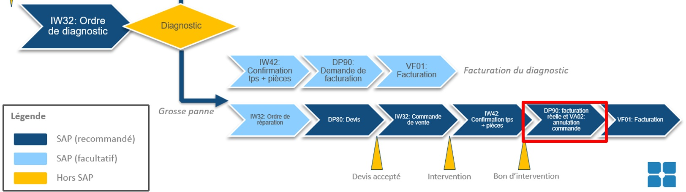

1. `Diagnostic`.
 
2. Création d'un `ordre de réparation sur coûts prévisionnels` (temps d'intervention et pièces) dans la [IW32](../../ABAP/22_Transactions/TCODE_IW32.md).
 
3. Création d'un `devis` dans la [DP80](../../ABAP/22_Transactions/TCODE_DP80.md) en lien à l'`ordre de réparation sur coûts prévisionnels`.
 
4. Acceptation du `devis` dans la [IW32](../../ABAP/22_Transactions/TCODE_IW32.md).
 
5. Génération automatique d'une `commande de vente sur charges prévisionnelles` dans la [IW32](../../ABAP/22_Transactions/TCODE_IW32.md).
 
6. Intervention et confirmation du temps et pièces réellement utilisées dans la [IW42](../../ABAP/22_Transactions/TCODE_IW42.md).
 
7. Création d'une `demande de facturation sur charges réelles` (commande de vente) dans la [DP90](../../ABAP/22_Transactions/TCODE_DP902.md).

8. Génération automatiquement d'une `commande de vente sur charges réelles` dans la [IW32](../../ABAP/22_Transactions/TCODE_IW32.md).
 
Il est donc nécessaire d’annuler la `commande de vente sur charges prévisionnelles` générée en référence au `devis` dans la [VA02](../../ABAP/22_Transactions/TCODE_VA02.md). C’est dans ce contexte que le programme devra intervenir.

## TECHNICAL DETAILS

| Table-Fields   | Description                              | Valeur     | Commentaire                                     |
|----------------|------------------------------------------|------------|-------------------------------------------------|
| `VBAK`         | DOCUMENT COMMERCIAL: HEADER              |            |                                                 |
| `VBAK-VBELN`   | Document de vente                        |            |                                                 |
| `VBAK-AUART`   | Type de document de vente                | ZOFF       |                                                 |
| `VBAK-AUFNR`   | Numéro d'ordre de service                |            |                                                 |
| `VBFA`         | FLUX DE DOCUMENTS COMMERCIAUX            |            |                                                 |
| `VBFA-VBELV`   | Document commercial précédent            | VBAK-VBELN |                                                 |
| `VBFA-POSNV`   | Poste précédent d'un document commercial |            | Erreur: POSNV non légitime ; remplacé par POSNN |
| `VBFA-POSNN`   | Poste suivant d'un document commercial   |            |                                                 |
| `VBRK`         | FACTURE: HEADER                          |            |                                                 |
| `VBRK-VBELN`   | Facture                                  | VBFA-VBELN |                                                 |
| `VBRK-FKART`   | Type de facturation                      |            |                                                 |
| `VBAP`         | DOCUMENT COMMERCIAL: POSTS               |            |                                                 |
| `VBAP-POSNR`   | Poste de document de vente               | VBFA-POSNN |                                                 |
| `VBAP-ABGRU`   | Motif de rejet des documents de vente    | Z2         |                                                 |

Les instructions suivantes pourront être appelées directement au moment de la création de la `demande de facturation` [DP90](../../ABAP/22_Transactions/TCODE_DP90.md) (avec le `numéro d'ordre de service - AUFNR`) qui devrait appeler l’[EXIT DE COMMANDE](../../ABAP/21_User_Exit/README.md) (`Program SAPMV45A - Include MV45AFZZ - User-Exit USEREXIT_SAVE_DOCUMENT`).

Avec le `numéro d'ordre de service - AUFNR` en cours de traitement :

-	Dans la table `VBAK - Document commercial - Header`, chercher si l’`ordre de service - VBAK-AUFNR` est lié à un `devis - VBAK-VBELN` :

  -	Filtrer sur le `numéro d’ordre de service - VBAK-AUFNR`

  -	Filtrer sur le `type de document 'ZOFF' - VBAK-AUART`

  -	Récupérer le `numéro du document devis - VBAK-VBELN`

  -	Si aucun numéro n’est trouvé, ne rien faire

-	Avec le `devis - VBAK-VBELN`, aller dans la table `VBFA - Flux de document` pour :

  - Trouver la `commande - VBFA-VBELV` associée au `devis - VBAK-VBELN` (`VBFA-VBELV` = `VBAK-VBELN`)

  - Récupérer le `numéro de la commande de vente - VBFA-VBELN` ainsi que l’intégralité des `postes - VBFA-POSNV` lié différent de `'Vide'`.

  - Avec le `numéro de commande - VBFA-VBELN`, aller sur la table `VBAP - Document commercial - Posts -` (`VBFA-VBELN` = `VBAP-VBELN`) pour :

  - Trouver tous les `Postes - VBAP-VBELN` liés au `numéro de commande - VBFA-VBELN` (`VBAP-VBELN` = `VBFA-VBELN` et `VBAP-POSNR = VBFA-POSNV`)

  - Ajouter le motif de refus `'Z2 Annulation automatique'` (`VBAP-ABGRU`) sur les `postes - VBAP-POSNR` trouvés.

  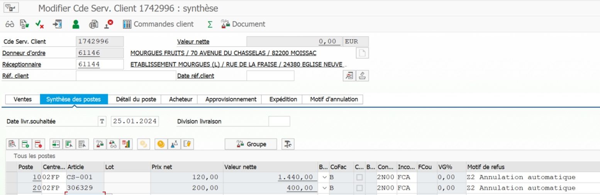

## CONTROLS

Vérifier qu’il n’y ait pas de `facture` (`VBFA-VBTYP_N = 'C' Commande client` dans le 2e `Select` de la `méthode static CANCEL_CS` de la `class ZCL_SD_COMMON_TOOLS`) faites en référence à la `commande` avant d’ajouter le `motif de refus - VBAP-ABGRU` (bloqué dans le comportement standard).

## TEST CASE

L’`AUFNR - Numéro d'ordre de service` suivant `'9000044'` (visible dans la [IW32](../../ABAP/22_Transactions/TCODE_IW32.md)) dispose déjà dans son `[ flux de document ]` d’un `devis` accepté, et donc de la `commande` qui lui est associé.

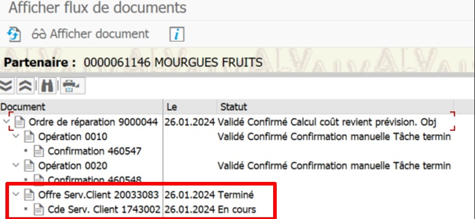

L’objectif du test est de générer une `demande de facturation sur charges réelles` [DP90](../../ABAP/22_Transactions/TCODE_DP90.md) qui devra en même temps modifier la `commande de vente - '1743002'` pour y ajouter les `motifs de refus` sur l’intégralité de ses `postes`.
 
Aller dans la [DP90](../../ABAP/22_Transactions/TCODE_DP90.md) et ajouter le `numéro d'ordre de service` suivant `'900044'`.

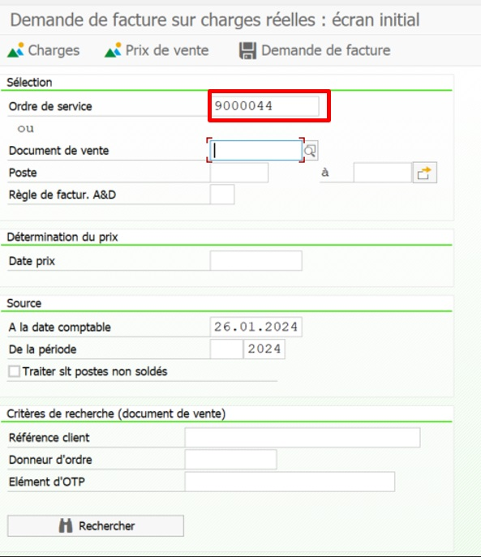

Appuyer sur `[ Entrer ]` puis sur `[ Demande de Facture ]` dans l'écran suivant.

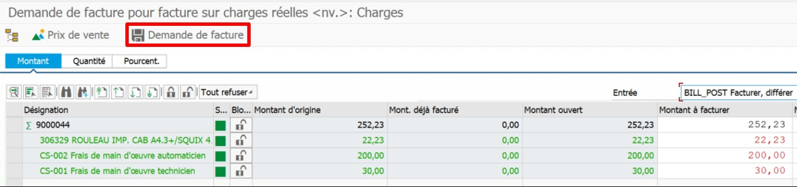

Appuyer sur `[ Oui ]` dans la pop-up.

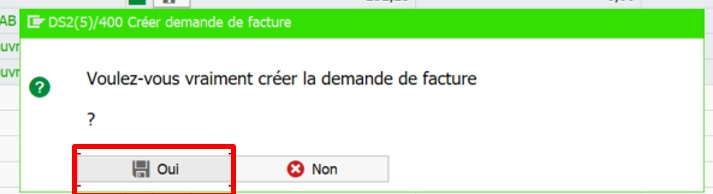

Aller observer le résultat dans la [VA03]() avec le `numéro de commande '1743002'`. Vérifier que le `motif de refus 'Z2 Annulation automatique'` est bien renseigné sur l'intégralité des `postes`.

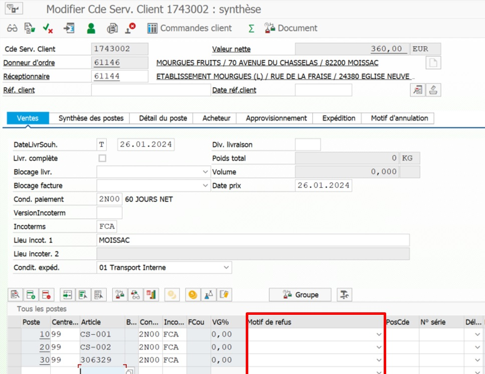

_Réutilisation_

 Pour réutiliser le même cas de test, aller dans la `demande de facturation` qui vient d’être créé (via la [DP90](../../ABAP/22_Transactions/TCODE_DP90.md)) et ajouter le `motif de refus 'Z1 : A traiter dans nv. Demande de facture'` sur l’ensemble des `postes`.

Cela permettra de générer une nouvelle `demande de facture` via la [DP90](../../ABAP/22_Transactions/TCODE_DP90.md).

## PATCH DOCUMENT

## TECHNICAL SOLUTION DESCRIPTION

## OBJETCS

| OT Type   | OT mat     | OT Description                                 |
|-----------|------------|------------------------------------------------|
| Workbench | None       | None                                           |

| Creation/Modification | Object type    | Object                 | Description                                    |
|-----------------------|----------------|------------------------|------------------------------------------------|
| Modification          | Program        | SAPMV45A               | Standard transaction                           |
|                       | - Include      | MV45AFZZ               | Include                                        |
|                       |   - UserExit   | USEREXIT_SAVE_DOCUMENT | Include                                        |
| Creation              | Class          | ZCL_SD_COMMON_TOOLS    | Standard transaction (package Z001)            |
|                       | - Method       | CANCEL_CS              | Cancel CS                                      |
|                       | - Job          | Z_CANCEL_CS_1743002    | Job                                            |
|                       | Program        | ZSD_CANCEL_CS          | Zprogram (package Z001)                        |

## UNIT TEST

### Version Simple

1. [TRANSACTION VA03]()

  - [ CDE SERV. CLIENT ] : `1743002`

    - [ MOTIF D'ANNULATION ]

    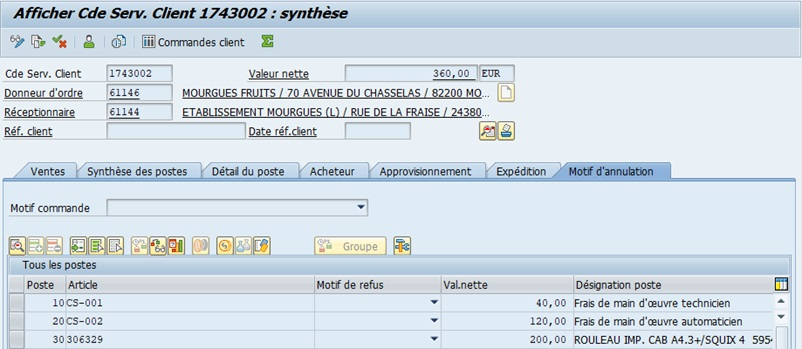

2. [TRANSACTION SE24](../../ABAP/22_Transactions/TCODE_SE24.md)

  - [ TYPE D'OBJET ] : `ZCL_SD_COMMON_TOOLS`

    - [ EXECUTE ] `CANCEL_CS` (Méthode)

    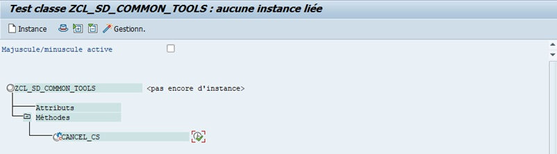

    - [ IV_AUFNR ] : `9000044`

    - [ IV_BATCH ] : `' '`

    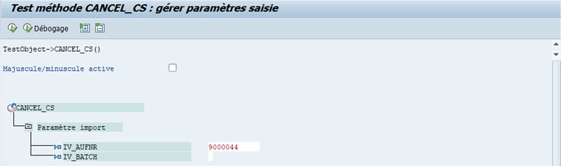

    - [ DEBOGAGE ] ou [ EXECUTE ]

    [ ... ]

    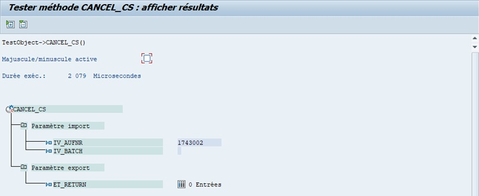

3. [TRANSACTION VA03]()

  - [ CDE SERV. CLIENT ] : `1743002`

      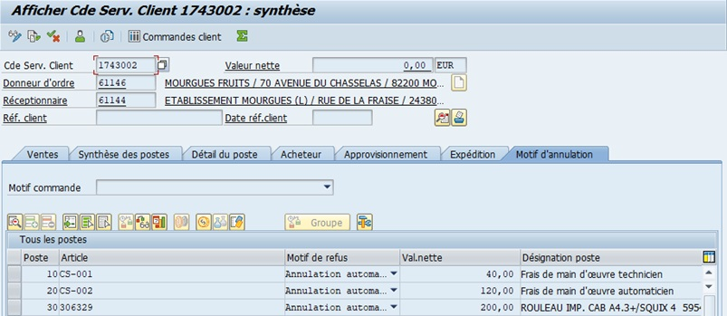

### Version Job

2. [TRANSACTION SE24](../../ABAP/22_Transactions/TCODE_SE24.md)

  - [ TYPE D'OBJET ] : `ZCL_SD_COMMON_TOOLS`

    - [ IV_AUFNR ] : `9000044`

    - [ IV_BATCH ] : `'X'`

    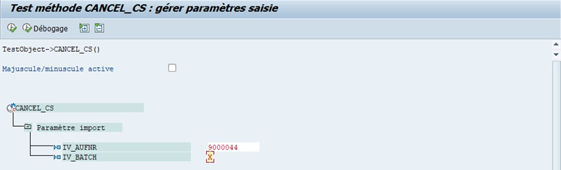

    [ ... ]

    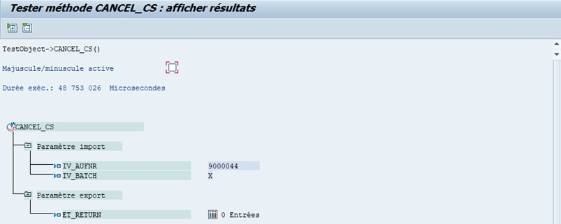

3. [TRANSACTION VA03]()

  - [ CDE SERV. CLIENT ] : `1743002`

      

4. [TRANSACTION SM37](../../ABAP/22_Transactions/TCODE_SM37.md)

  - [ JOBNAME ] : `Z_CANCEL_CS_1743002`

      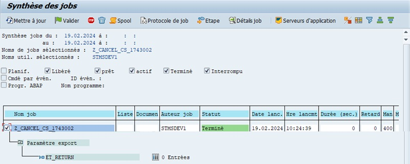

## PROGRAM

### [SE80](../../ABAP/22_Transactions/TCODE_SE80.md) SAPMV45A

```abap
FORM USEREXIT_SAVE_DOCUMENT.
    ENHANCEMENT 13  ZES_SAPMV45A.

    "...
*Début-Annulation de commande devis CS-FGI(+)
        IF VBAK-AUFNR IS NOT INITIAL.
            CALL METHOD ZCL_SD_COMMON_TOOLS=>CANCEL_CS
                EXPORTING
                    IV_AUFNR = VBAK-AUFNR
                    IV_BATCH = ABAP_TRUE.
        ENDIF.
*Début-Annulation de commande devis CS-FGI(+)

    "...

    ENDENHANCEMENT.
ENDFORM.
```

### [SE24](../../ABAP/22_Transactions/TCODE_SE24.md) _CLASS_

- CLASS: ZCL_SD_COMMON_TOOLS

    - METHOD: CANCEL_ORDER_QUOTE

#### METHODES

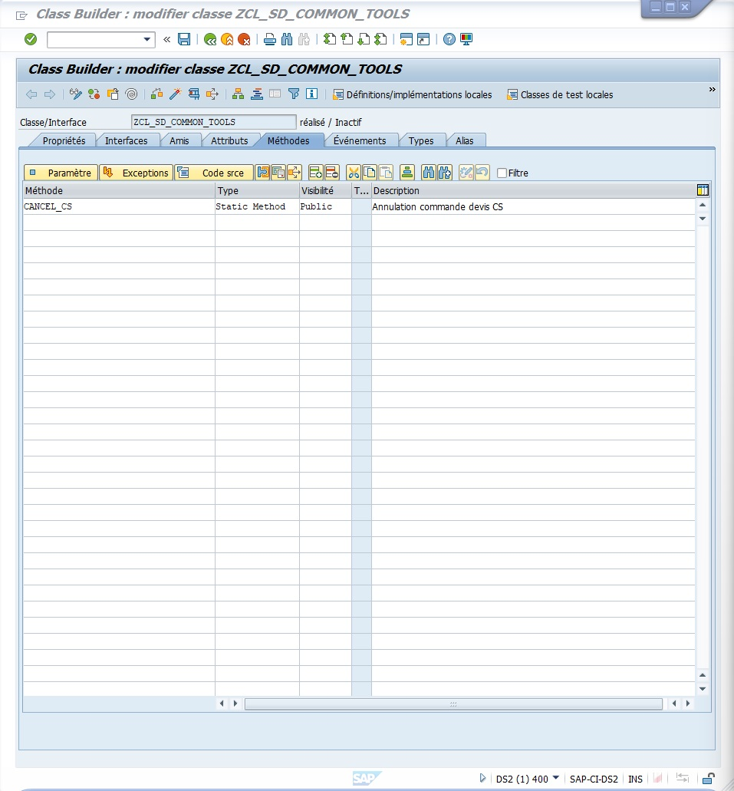

#### PARAMETRES

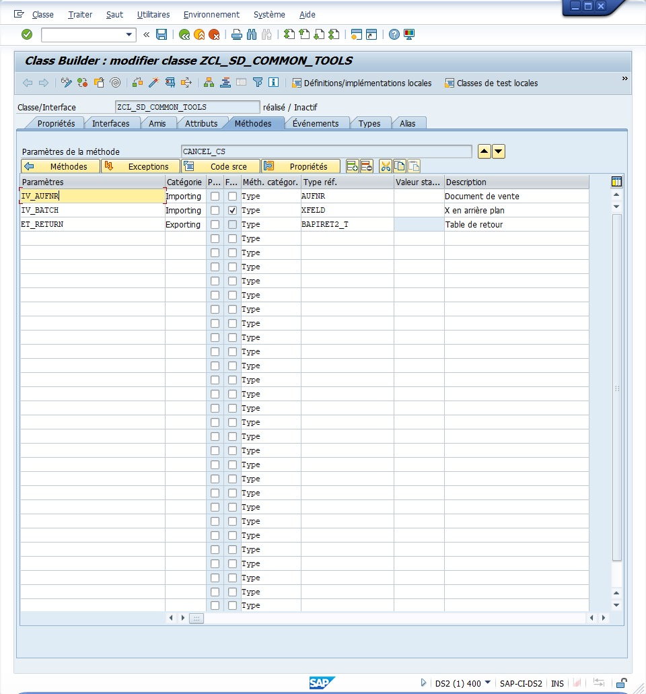

#### CODE SOURCE

```abap
  METHOD CANCEL_CS.

********************************************************* DECLARATIONS

    " Tables internes
    DATA: LT_ITEM_IN  TYPE STANDARD TABLE OF BAPISDITM,
          LT_ITEM_INX TYPE STANDARD TABLE OF BAPISDITMX,
          LS_ORDER_X  TYPE BAPISDH1X.

    " JOB déclarations
    DATA: LV_JOBNAME  TYPE TBTCJOB-JOBNAME,
          LV_JOBCOUNT TYPE TBTCJOB-JOBCOUNT.

    LV_JOBNAME = 'Z_CANCEL_CS_1743002'.

******************************************* SUBMIT DU PROG DANS UN JOB

    IF IV_BATCH IS NOT INITIAL.

      CALL FUNCTION 'JOB_OPEN'
        EXPORTING
          JOBNAME          = LV_JOBNAME
        IMPORTING
          JOBCOUNT         = LV_JOBCOUNT      " Numéro d'identification du travail en arrière-plan
        EXCEPTIONS
          CANT_CREATE_JOB  = 1
          INVALID_JOB_DATA = 2
          JOBNAME_MISSING  = 3
          OTHERS           = 4.
      IF SY-SUBRC <> 0.
        MESSAGE ID SY-MSGID TYPE SY-MSGTY NUMBER SY-MSGNO
        WITH SY-MSGV1 SY-MSGV2 SY-MSGV3 SY-MSGV4.
      ENDIF.

      SUBMIT ZSD_CANCEL_CS
        WITH P_AUFNR = IV_AUFNR
        VIA JOB LV_JOBNAME NUMBER LV_JOBCOUNT
        AND RETURN.

      CALL FUNCTION 'JOB_CLOSE'
        EXPORTING
          JOBCOUNT             = LV_JOBCOUNT
          JOBNAME              = LV_JOBNAME
          STRTIMMED            = 'X'
        EXCEPTIONS
          CANT_START_IMMEDIATE = 1
          INVALID_STARTDATE    = 2
          JOBNAME_MISSING      = 3
          JOB_CLOSE_FAILED     = 4
          JOB_NOSTEPS          = 5
          JOB_NOTEX            = 6
          LOCK_FAILED          = 7
          INVALID_TARGET       = 8
          INVALID_TIME_ZONE    = 9
          OTHERS               = 10.
      IF SY-SUBRC <> 0.
        MESSAGE ID SY-MSGID TYPE SY-MSGTY NUMBER SY-MSGNO
        WITH SY-MSGV1 SY-MSGV2 SY-MSGV3 SY-MSGV4.
      ENDIF.
      RETURN.
    ENDIF.

******************************************* DATA RETRIEVING & CONTROLS

    " Sélection des données depuis la VBAK et filtres
    SELECT VBELN
      FROM VBAK
      WHERE AUART = 'ZOFF'
        AND AUFNR = @IV_AUFNR
      INTO TABLE @DATA(LT_VBAK).
    IF SY-SUBRC <> 0.
      "Pas de cde on quitte
      RETURN.
    ENDIF.

    " Sélection des données depuis la VBFA et filtres
    SELECT VBELN, POSNN
      FROM VBFA
      FOR ALL ENTRIES IN @LT_VBAK
      WHERE VBELV = @LT_VBAK-VBELN
        AND POSNV <> ''
        AND VBTYP_N = 'C'    "Commande de vente
      INTO TABLE @DATA(LT_VBFA).
    IF SY-SUBRC <> 0.
      "Pas de cde de vente associée au devis. On quitte
      RETURN.
    ENDIF.

    "On ne conserve que les poste qui ne sont pas déjà annulés
    SELECT VBELN, POSNR, MATNR
      FROM VBAP
      FOR ALL ENTRIES IN @LT_VBFA
      WHERE VBELN = @LT_VBFA-VBELN
        AND POSNR = @LT_VBFA-POSNN
        AND ABGRU  = ''
      INTO TABLE @DATA(LT_VBAP).
    IF SY-SUBRC <> 0.
      RETURN.
    ENDIF.

********************************************************* DATA MAPPING

    SORT LT_VBAP BY VBELN POSNR.

    LOOP AT LT_VBAP ASSIGNING FIELD-SYMBOL(<LFS_VBAP>).

      "Pour traiter chaque commande
      AT NEW VBELN.
        CLEAR : LT_ITEM_IN,
                LT_ITEM_INX,
                ET_RETURN.
      ENDAT.

      " (Niveau en-tête de commande)
      LS_ORDER_X-UPDATEFLAG = 'U'.

      " Définition de l'indicateur de mise à jour au niveau de
      " l'en-tête de commande en mode mise à jour.
      APPEND INITIAL LINE TO LT_ITEM_IN ASSIGNING FIELD-SYMBOL(<FS_ITEM_IN>).
      APPEND INITIAL LINE TO LT_ITEM_INX ASSIGNING FIELD-SYMBOL(<FS_ITEM_INX>).

      " (Niveau d'article de commande)
      " Paramétrage du numéro d'article (MATNR) au niveau de l'article de commande.
      <FS_ITEM_IN>-MATERIAL = <LFS_VBAP>-MATNR.

      " Paramétrage du numéro d'article (POSNR) au niveau de l'article de commande.
      <FS_ITEM_IN>-ITM_NUMBER  = <LFS_VBAP>-POSNR.

      " Paramétrage du motif de rejet (ABGRU) au niveau du poste de commande.
      <FS_ITEM_IN>-REASON_REJ  = 'Z2'.
      <FS_ITEM_INX>-REASON_REJ = 'X'.

      " Définition de l'indicateur de mise à jour au niveau de l'article de commande en mode mise à jour.
      <FS_ITEM_INX>-UPDATEFLAG = 'U'.

      "Mettre à jour la commande
      AT END OF VBELN.

*---------------------------------------------------------------------*
*---------------------------------------------------------------------*
        " Appel de BAPI pour mettre à jour le motif du rejet dans la commande sélectionnée.
        CALL FUNCTION 'BAPI_SALESORDER_CHANGE'
          EXPORTING
            salesdocument    = <lfs_vbap>-vbeln
            order_header_inx = ls_order_x
          TABLES
            return           = et_return
            order_item_in    = lt_item_in
            order_item_inx   = lt_item_inx.
**      " Vérifiez si au moins une erreur a été générée par le BAPI. Boucle à l'intérieur
**      " La boucle n'est pas conseillée, cependant, la table de retour contiendra un petit
**      " nombre d'entrées.
        LOOP AT et_return TRANSPORTING NO FIELDS WHERE type = 'E' OR type = 'A'.
          EXIT.
        ENDLOOP.
        IF sy-subrc = 0.
          CALL FUNCTION 'BAPI_TRANSACTION_ROLLBACK'.
        ELSE.
          CALL FUNCTION 'BAPI_TRANSACTION_COMMIT'.
        ENDIF.

*---------------------------------------------------------------------*
*---------------------------------------------------------------------*
      ENDAT.

    ENDLOOP.

  ENDMETHOD.
```

### [SE80](../../ABAP/22_Transactions/TCODE_SE80.md) ZSD_CANCEL_CS

```abap
*&---------------------------------------------------------------------*
*& Report ZSD_CANCEL_CS
*&---------------------------------------------------------------------*
*&
*&---------------------------------------------------------------------*
*&
*&---------------------------------------------------------------------*
*  Ticket : <NUMBER>                                                   *
*  Titre  : SD Annulation commande devis CS                            *
* -------------------------------------------------------------------- *
*  Auteur : FGI(STMS)                                                  *
*  Date   : 14/02/2024                                                 *
*                                                                      *
* Programme appelé (submit) depuis le programme SAPMV45A               *
*                                       Include MV45AFZZ               *
*                                                                      *
* Appel de la méthode SCL_SD_COMMON_TOOLS=>CANCEL_CS pour modifier le  *
* motif de rejet d'une commande de vente                               *
*                                                                      *
* -------------------------------------------------------------------- *
*  Historique des modifications                                        *
* -------------------------------------------------------------------- *
*  Date    | Author     | Signature | Ticket - Object                  *
* -------------------------------------------------------------------- *
*  JJ/MM/AA  XXXXXXXXX    XXXJJMMAA   xxxx                             *
************************************************************************
*&
*&---------------------------------------------------------------------*

REPORT ZSD_CANCEL_CS.

INCLUDE ZSD_CANCEL_CS_SCR.
INCLUDE ZSD_CANCEL_CS_F01.

INITIALIZATION.

START-OF-SELECTION.

  PERFORM CANCEL_CS.

END-OF-SELECTION.
```

### [SE80](../../ABAP/22_Transactions/TCODE_SE80.md) ZSD_CANCEL_CS_SCR

```abap
*&---------------------------------------------------------------------*
*& Include          ZSD_CANCEL_CS_SCR
*&---------------------------------------------------------------------*

PARAMETERS: P_AUFNR TYPE AUFNR OBLIGATORY.
```

### [SE80](../../ABAP/22_Transactions/TCODE_SE80.md) ZSD_CANCEL_CS_F01

```abap
*&---------------------------------------------------------------------*
*& Include          ZSD_CANCEL_CS_F01
*&---------------------------------------------------------------------*
*&---------------------------------------------------------------------*
*& Form CANCEL_CS
*&---------------------------------------------------------------------*
*& text
*&---------------------------------------------------------------------*
*& -->  p1        text
*& <--  p2        text
*&---------------------------------------------------------------------*
FORM CANCEL_CS .

  DATA: LT_RETURN        TYPE BAPIRET2_T,
        LO_ALV           TYPE REF TO CL_SALV_TABLE,
        LO_ALV_FUNCTIONS TYPE REF TO CL_SALV_FUNCTIONS,
        LO_COLUMNS       TYPE REF TO CL_SALV_COLUMNS_TABLE,
        LO_MESSAGE       TYPE REF TO CX_SALV_MSG,
        LV_STRING        TYPE STRING.

  CALL METHOD ZCL_SD_COMMON_TOOLS=>CANCEL_CS
    EXPORTING
      IV_AUFNR  = P_AUFNR
    IMPORTING
      ET_RETURN = LT_RETURN.

  LOOP AT LT_RETURN TRANSPORTING NO FIELDS
    WHERE TYPE = 'E'
       OR TYPE = 'A'.
    EXIT.
  ENDLOOP.

  IF SY-SUBRC = 0.
    TRY.
        CALL METHOD CL_SALV_TABLE=>FACTORY(
          IMPORTING
            R_SALV_TABLE = LO_ALV
          CHANGING
            T_TABLE      = LT_RETURN ).

      CATCH CX_SALV_MSG INTO LO_MESSAGE.

      CLEANUP.
    ENDTRY.

  ENDIF.

ENDFORM.
```


