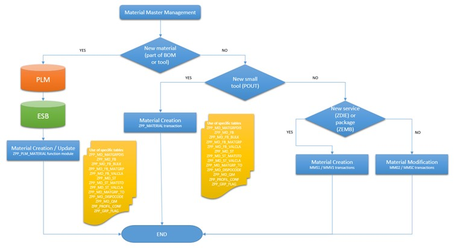
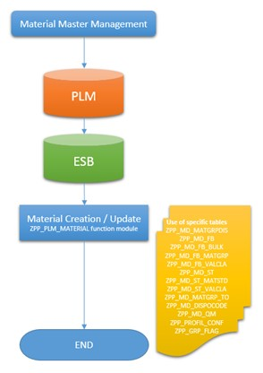

# **MATERIAL MASTER CREATION**

## TERMINOLOGY

| **TERMINOLOGY** | **DESCRIPTION**                                                                                                                                                            |
|-----------------|----------------------------------------------------------------------------------------------------------------------------------------------------------------------------|
| BOM             | Bill of materials                                                                                                                                                          |
| BUM             | Base Unit of Measure: unit in which the material stocks are managed. If another unit is mandatory for the material, then BUM is the reference.                             |
| FFF             | Form Fit Function                                                                                                                                                          |
| ME              | Manufacturing Engineering – (ie. Technologist for LLV/IS or PT Préparation Technique for FR)                                                                               |
| ML              | Material Ledger                                                                                                                                                            |
| PLM             | Product Lifecycle Management : system that regroups the processes and objects that are used in the conception or in the configuration management of a product or a process |
| CA              | Composant Acheté                                                                                                                                                           |
| CC              | Composant Confié                                                                                                                                                           |
| CO              | Controlling module of SAP                                                                                                                                                  |
| FI              | Finance module of SAP                                                                                                                                                      |
| IS              | Latécoère Interconnexion Systems                                                                                                                                           |
| AF              | Article Fabriqué                                                                                                                                                           |
| AFC             | Article Fabriqué Configurable                                                                                                                                              |
| AS              | Latécoère Aérostructure                                                                                                                                                    |
| MSN             | Manufacturing Serial Number (Customer Number)                                                                                                                              |
| OUT             | Outillage                                                                                                                                                                  |
| POUT            | Petit Outillage                                                                                                                                                            |
| AD              | Non-aeronautic purchased component                                                                                                                                         |
| ZDIE            | Services                                                                                                                                                                   |
| ZEMB            | Packaging purchased                                                                                                                                                        |
| PC2             | Page 19 ?                                                                                                                                                                  |
| PLANT           | sites d'opération (PLANT : production, procurement, maintenant et materials planning)                                                                                      |

## OBJECTIVES

MATERIEL :

- Creation (MM01)
- Modification
- Mise à jour (manuellement en MM02)

Création et modification de materiel varie en fonction de leur `CATEGORY`

## SOLUTION DESCRIPTION

- Material number: `KEY` unique alphanumeric
- Industry sector: `KEY` (conditionne les données/champs obligatoires)
- Material type: `KEY` représente le materiel dans le flus et en yterme d'autorisation de vue (d'accès)

> Les données basique sont client dépendante : les données sont uniques en fonction des sites d'opération (PLANT : production, procurement, maintenant et materials planning)

## VIEW

- 2.4.1.1.5 Sales organizational view 1
- 2.4.1.1.6 Sales organizational view 2
- 2.4.1.1.7 Sales: General / Plant view
- 2.4.1.1.8 Sales texts (not used)
- 2.4.1.1.9 Purchasing view 
- 2.4.1.1.10 Foreign trade import & export view
- 2.4.1.1.11 Purchased order text (not used)
- 2.4.1.1.12 MRP1 view
- 2.4.1.1.13 MRP2 view
- 2.4.1.1.14 MRP3 view
- 2.4.1.1.15 MRP4 view
- 2.4.1.1.16 Work Scheduling view
- 2.4.1.1.17 Production resources/tools view 
- 2.4.1.1.18 Plant Data / Storage1 view 
- 2.4.1.1.19 Storage 2 view
- 2.4.1.1.20 Quality view
- 2.4.1.1.21 Accounting 1 view
- 2.4.1.1.22 Accounting 2
- 2.4.1.1.23 Costing 1 view
- 2.4.1.1.24 Costing 2 view

## ADDITIONAL DATA

- 2.4.1.2 Material creation for AS (Latécoère Aérostructure)
- 2.4.1.3 Material updating for AS
- 2.4.1.4 Configuration elements (IS) (Latécoère Interconnexion Systems)
- 2.4.1.5 Configuration profile creation
- 2.4.1.6 Classification creation
- 2.4.1.7 Modification follow-up
- 2.4.1.8 Tools management

## FLOW

- 2.6.3.1 Interface PLM -> SAP: Material creation - ZPP_PLM_MATERIAL
- 2.6.3.2 Interface SAP -> PLM:  Aircraft tables - ZPP_EXTRAC_TAB_AVION
- 2.6.3.3 Transaction ZPP_MATERIAL – Material creation
- 2.6.3.4 Specific “Create” transactions – Material creation
- 2.6.3.5 Transaction ZPP_TAV - Manage aircraft tables
- 2.6.3.6 Transaction ZPP_PROFIL_CONFIG - Check configuration profiles
- 2.6.3.7 Transaction ZPP_CU60_DISPLAY - Display Configuration variant
- 2.6.3.8 Transaction ZPP_MASSEART - Net weight of materials
- 2.6.3.9 Transaction ZPP001 - UGI management

## TICKET M_0031938 - FGI(+)

OT: DE1K929490      L0019861     W_MM_LAT_DT31938 : MRP Controler and Purch group update

TRANSACTION:    ZMM_T024 (Purchasing Master Data)
PROGRAM:        ZMM_MAJ_T024 - Update Table T024
MESSAGE CLASS:  ZMM_MAJ_T024_MESSAGE
    PACKAGE:    Z001
BAL_LOG:        ZMM_MAJ_T024_LOG

=> PROGRAM ?

### SELECTION SCREEN

(EKKO-EKGRP = T024-EKGRP)

| FIELD NUMBER | FIELD                                              | TABLE-FIELD     | FORMAT    | DESCRIPTION       |
|--------------|----------------------------------------------------|-----------------|-----------|-------------------|
| F01          | Purchasing Group                                   | T024-EKGRP      | CHAR(3)   |                   |
| F02          | Description Purchasing Group                       | T024-EKNAM      | CHAR(18)  |                   |
| F03          | Telephone number of purchasing group (buyer group) | T024-EKTEL      | CHAR(12)  |                   |
| F04          | Fax number of purchasing (buyer) group             | T024-TELFX      | CHAR(31)  |                   |
| F05          | Telephone no.: dialling code+number                | T024-TEL_NUMBER | CHAR(30)  |                   |
| F06          | Telephone no.: Extension                           | T024-TEL_EXTENS | CHAR(10)  |                   |
| F07          | E-Mail Address                                     | T024-SMTP_ADDR  | CHAR(241) |                   |
| F08          | User Name in User Master Record                    | USR01-BNAME     | CHATR(12) | Exemple: L0000101 |

### RULES

#### SS01 - INITIAL CHECK

    Explication: This transaction can’t be used to create a new entry.

    => Check if an entry exist in T024 table with the purchasing group filled in the selection screen.

    => If entrey doesnt exist : error message EM01
        - EN: "The purchasing group XXX doesnt exist"
        - FR: "Le groupe d'acheteuyr XXX n'existe pas"

    > Chercher si classe de message existe

#### SS02 - INITIAL CHECK

    Explication: The user must exist in the System

    => Check existence of the user filled in the selection screen

    => If entry doesnt exist : error message EM02
        - EN: "The user L00XXXXX doesn’t exist in this system"
        - FR: "L’utilisateur L00XXXXX n’est pas créé dans ce systeme"

    > Chercher si classe de message existe

#### SS03 - INITIAL CHECK

    Explication: The transaction can only be used in front side

    => ???

#### SS04 - ACCESS

    Explication: Access to this transaction have to be validated by a role.

    => ??? Pas MOA

#### TRANSLATION

[TRANSACTION SE91]()

    Go to the destination message in [SE91](). Login in the language you want to translate. If asked for the option check Maintain in original language. Go to [SE63]() Language Translation envirnoment and translate accordingly.

### LOGS

    > Chercher classe de Log dans le programme

    => ADD : User sy-uname qui met à jour le PG         sy-uname

       ADD : Purchasing Group                           p_ekgrp

       ADD : Old User ?!                                wa_t024-bname

       ADD : New User ?!                                wa_t024-bname SI p_bname = ' ' SINON wa_t024-bname

       ADD : Old Description                            wa_t024-EKNAM

       ADD : New Description                            wa_t024-EKNAM SI p_EKNAM = ' ' SINON wa_t024-EKNAM

       ADD : Old Email Address                          wa_t024-SMTP_ADDR

       ADD : New Email Address                          wa_t024-SMTP_ADDR SI p_email = ' ' SINON wa_t024-SMTP_ADDR

## TICKET --------------------------------------------------------------

ZMM_T024D (Material Master Data)

This transaction is used to update data from V_T024D view.

TRANSACTION:    ZPP_MRP_CONTROLER_UPDATE - Update data from V_T024D view
PROGRAM:        ZMM_MAJ_T024D - Update data from V_T024D view

### SELECTION SCREEN

ZMM_MAJ_T024D
| FIELD NUMBER | FIELD               | TABLE-FIELD | FORMAT    | DESCRIPTION                                         |
|--------------|---------------------|-------------|-----------|-----------------------------------------------------|
| F01          | PLANT               | T024D-WERKS | CHAR(4)   | MANDATORY MATCH CODE and CHECK manage on this field |
| F02          | MRP Controller code | T024D-DISPO | CHAR(3)   | MANDATORY                                           |
| F03          | EN description      |             | CHAR(18)  | MANDATORY                                           |      ADRC-NAME1                   ?!  Description en ANGLAIS mais de quoi ?!
| F04          | Plant Language desc |             | CHAR(18)  | MANDATORY                                           |      ADRC-LANGU                   ?!
| F05          | Telephone no        |             | CHAR(12)  |                                                     |      ADRC-TEL_NUMBER              ?!
| F06          | Reciptient Name     |             | CHAR(12)  |                                                     |      UNKNOW                       ?!
| F07          | Business Area       | TGSB-GSBER  | CHAR(4)   | MATCH CODE CHECK manage on this field (table TGSB)  |      OK
| F08          | Profit Center       | MARC-PRCTR  | CHAR(241) | MATCH CODE CHECK manage on this field               |      OK
| F09          | Recipient (E-MAIL)  |             | CHAR(250) | MANDATORY                                           |
| F10          | Recipient SAP user  |             | CHAR(12)  | MANDATORY                                           |

TABLES: T024D
        T001W where T001W-WERKS = T024D-WERKS
        ADRC  where T001W-ADRNR = ADRC-ADRNR
        MARC  where T001W-WERKS = MARC-WERKS

### RULES

#### SS00 - EM01

    Explication: Pour les champs :
        - PLANT
        - MRP controller code
        - EN description
        - Plant language description
        - Recipient (e-mail)
        - Recipient SAP user
    Si les données MANDATORY ne sont pas disponible

    => ERROR MESSAGE EM01
        - EN: All mandatories data are not availlable
        - FR: Toutes les données obligatoires ne sont pas disponibles

    > Chercher si classe de message existe sinon en créer

#### SS01 - RECIPIENT & RECIPIENT TYPE

    Explication: If the recipient has more than 50C
        - Recipient SAP user

    => use the recipient type US with the SAP user in field Recipient
    => use the recipient type P with the e-mail adresse

#### SS02 - SAP USER

    Explication: vérifier que l'utilisateur existe MAIS OU ?????

    => CHECK si user exist sinon : ERROR MESSAGE EM02
        - EN: The User L00XXXXX doesn’t exist
        - FR: L’utilisateur L00XXXXX n’est pas créé dans ce systeme

    > Chercher si classe de message existe sinon en créer

#### SS03 - CHECK MRP CONTROLLER

    Explication: Vérifier le l'entrée existe

    => ERROR MESSAGE EM03
        - EN: The MRP controller XXX doesn’t exist
        - FR: Le MRP contrôleur XXX n’existe pas.

    > Chercher si classe de message existe sinon en créer