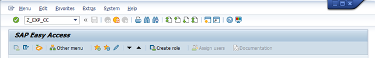
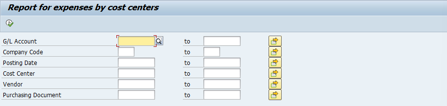
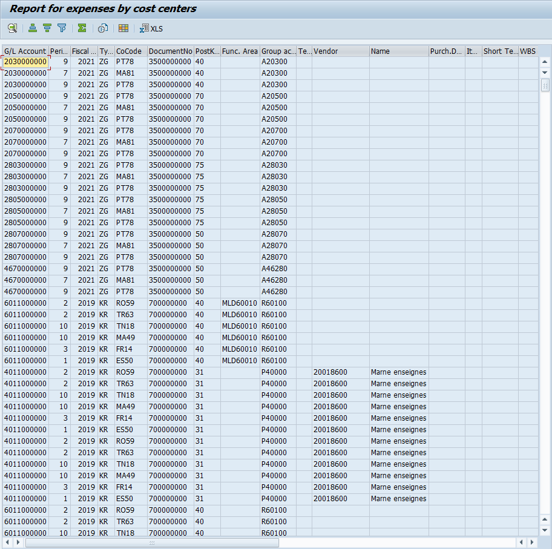
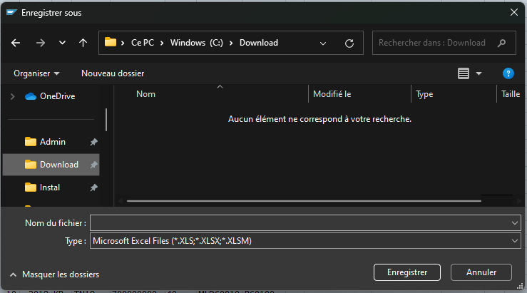
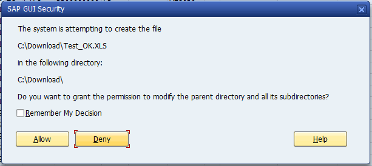

# **TICKET 767**

## DOCUMENT HISTORY

| Version(s)  | Rédacteur(s)  | Date                | Modification(s)                 |
|-------------|---------------|---------------------|---------------------------------|
| 1.0         | F.P******     | 08/02/2024          | Initialization of the document  |
| 1.1         | F.G*******    | 22/02/2024          | Patch document                  |

## OVERVIEW

The objective of this functional specification is to :

-	Get a report that gives the amount of purchases broken down by cost centers.

-	This report may be a Z transaction or a query 

## FUNCTIONNAL REQUIREMENT

Only Cost center responsibles, cost controllers, financial controller should be able to access this Z transaction or query. SAP roles will be modified accordingly.

## TECHNICAL DETAILS

_Selection screen_

    Company code            From [  ] To [   ]
    Posting date            From [  ] To [   ]
    Cost centers            From [  ] To [   ]
    Vendor                  From [  ] To [   ]
    Purchase order number   From [  ] To [   ]

_Fields to get to build_

|    | Field name               | Technical name           | Rule                                                       | Type           | Len. | Pos. |
|:--:|--------------------------|--------------------------|------------------------------------------------------------|----------------|:----:|:----:|
| 1  | G/L Account              | BSEG-HKONT               |                                                            | AlphaNum       | 10   | 1    |
| 2  | Month                    | BSEG-MONAT               |                                                            | Num            | 2    | 11   |
| 3  | Year                     | BSEG-GJAHR               |                                                            | Num            | 4    | 13   |
| 4  | Document type            | BKPF-BELART              |                                                            | Alpha          | 2    | 17   |
| 5  | Offsetting account       | TBD                      |                                                            | Num            | 10   | 19   |
| 6  | Company code             | BKPF-BUKRS               |                                                            | AlphaNum       | 4    | 29   |
| 7  | Document number          | BKPF-BELNR               |                                                            | Num            | 10   | 33   |
| 8  | Posting key              | BSEG-BSCHL               |                                                            | Num            | 2    | 43   |
| 9  | Functional area          | BSEG-FKBER_LONG          |                                                            | Alpha          | 3    | 45   |
| 10 | Group account            | BSEG-ALTKT               |                                                            | AlphaNum       | 6    | 48   |
| 11 | Text                     | BSEG-SGTXT               |                                                            | AlphaNum       | 50   | 54   |
| 12 | Vendor number            | BSEG-LIFNR or BSEG-SGTXT | If BKPF-BELART = 'KR' => BSEG-LIFNR Else => BSEG-SGTXT(10) | Num            | 10   | 104  |
| 13 | Vendor name              | LFA1-NAME1               | 25 first digits                                            | AlphaNum       | 25   | 114  |
| 14 | PO Number                | BSEG-EBELN               |                                                            | Num            | 10   | 139  |
| 15 | PO Item number           | BSEG-EBELP               |                                                            | Num            | 5    | 149  |
| 16 | Item text                | TBD                      | 20 first digits                                            | AlphaNum       | 20   | 154  |
| 17 | WBS Element              | BSEG-PROJK               |                                                            | AlphaNum       | 10   | 174  |
| 18 | Cost center              | BSEG-KOSTL               |                                                            | AlphaNum       | 10   | 184  |
| 19 | Profit center            | BSEG-KOSTL               |                                                            | AlphaNum       | 10   | 174  |
| 20 | Assignment               | BSEG-ZUONR               | 10 first digits                                            | AlphaNum       | 10   | 204  |
| 21 | Document date            | BSEG-BELNR               |                                                            | Num            | 10   | 214  |
| 22 | Posting date             | BSEG-BUDAT               |                                                            | Num            | 10   | 224  |
| 23 | Amount in local currency | BSEG-DMBTR               |                                                            | Num w/ Decimal | 10+2 | 234  |
| 24 | Currency                 | BSEG-WAERS               |                                                            | Alpha          | 3    | 247  |

Le résultat devra être exportable vers Excel.

## SCOPE

Tables involved :

- BSEG

- BKPF

- LFA1

- EKPO

Any other table needed for this report can be added and should be added to the list above.

## CONTROLS

## TEST CASE

[Empty]

## PATCH DOCUMENT

_Selection screen_

    GL account              From [  ] To [   ]
    Company code            From [  ] To [   ]
    Posting date            From [  ] To [   ]
    Cost centers            From [  ] To [   ]
    Vendor number           From [  ] To [   ]
    Purchase order number   From [  ] To [   ]

_Fields to get to build_

|    | Field name               | Technical name           | Rule                                                       | Type           | Len. | Pos. |
|:--:|--------------------------|--------------------------|------------------------------------------------------------|----------------|:----:|:----:|
| 1  | G/L Account              | BSEG-HKONT               |                                                            | AlphaNum       | 10   | 1    |
| 2  | Month                    | BKPF-MONAT               |                                                            | Num            | 2    | 11   |
| 3  | Year                     | BSEG-GJAHR               |                                                            | Num            | 4    | 13   |
| 4  | Document type            | BKPF-BLART               |                                                            | Alpha          | 2    | 17   |
| 6  | Company code             | BKPF-BUKRS               |                                                            | AlphaNum       | 4    | 29   |
| 7  | Document number          | BKPF-BELNR               |                                                            | Num            | 10   | 33   |
| 8  | Posting key              | BSEG-BSCHL               |                                                            | Num            | 2    | 43   |
| 9  | Functional area          | BSEG-FKBER_LONG          |                                                            | Alpha          | 3    | 45   |
| 10 | Group account            | BSEG-ALTKT               |                                                            | AlphaNum       | 6    | 48   |
| 11 | Text                     | BSEG-SGTXT               |                                                            | AlphaNum       | 50   | 54   |
| 12 | Vendor number            | BSEG-LIFNR or BSEG-SGTXT | If BKPF-BLART = 'KR' => BSEG-LIFNR Else => ' '             | Num            | 10   | 104  |
| 13 | Vendor name              | LFA1-NAME1               | 25 first digits (if 12 is display)                         | AlphaNum       | 25   | 114  |
| 14 | PO Number                | BSEG-EBELN               |                                                            | Num            | 10   | 139  |
| 15 | PO Item number           | BSEG-EBELP               |                                                            | Num            | 5    | 149  |
| 16 | Item text                | EKPO-TXZ01               | 20 first digits                                            | AlphaNum       | 20   | 154  |
| 17 | WBS Element              | BSEG-PROJK               |                                                            | AlphaNum       | 10   | 174  |
| 18 | Cost center              | BSEG-KOSTL               |                                                            | AlphaNum       | 10   | 184  |
| 19 | Profit center            | BSEG-KOSTL               |                                                            | AlphaNum       | 10   | 174  |
| 20 | Assignment               | BSEG-ZUONR               | 10 first digits                                            | AlphaNum       | 10   | 204  |
| 21 | Document date            | BKPF-BLDAT               |                                                            | Num            | 10   | 214  |
| 22 | Posting date             | BKPF-BUDAT               |                                                            | Num            | 10   | 224  |
| 23 | Amount in local currency | BSEG-DMBTR               |                                                            | Num w/ Decimal | 10+2 | 234  |
| 24 | Currency                 | BSEG-PSWSL               |                                                            | Alpha          | 3    | 247  |

## TECHNICAL SOLUTION DESCRIPTION

La transaction Z_EXP_CC lance le programme Z_RPTFI_EXP_CC et affiche les données en fonction des paramètres entrés avec possibilité d'exporter l'ALV en version XLS.

## OBJECTS

| OT Type   | OT mat     | OT Description                                 |
|-----------|------------|------------------------------------------------|
| Workbench | DV1K941800 | FGI- M_18714 - Report Expenses By Cost Centers |

| Creation/Modification | Object type  | Object         | Description                                    |
|-----------------------|--------------|----------------|------------------------------------------------|
| Creation              | Transaction  | Z_EXP_CC       | Transaction calling the program Z_RPTFI_EXP_CC |
|                       | Program      | Z_RPTFI_EXP_CC | Report for exepenses by cost centers           |

## UNIT TEST













## PROGRAM

### [SE80] Z_EXP_CC_M_18714

```abap
*&---------------------------------------------------------------------*
*& Report  Z_EXP_CC_M_18714
*&
*&---------------------------------------------------------------------*
*&
*&
*&---------------------------------------------------------------------*
REPORT z_rptfi_exp_cc.

INCLUDE z_rptfi_exp_cc_lcl.
INCLUDE z_rptfi_exp_cc_top.
INCLUDE z_rptfi_exp_cc_scr.
INCLUDE z_rptfi_exp_cc_f01.

INITIALIZATION.

START-OF-SELECTION.

  PERFORM data_initialization.
  PERFORM data_retrieving.
  PERFORM data_processing.

END-OF-SELECTION.

  PERFORM data_displaying.
```

### [SE80] Z_EXP_CC_M_18714_LCL

```abap
*----------------------------------------------------------------------*
***INCLUDE Z_EXP_CC_M_18714_LCL.
*----------------------------------------------------------------------*
*&---------------------------------------------------------------------*
*&       Class LCL_HANDLER_EVENTS
*&---------------------------------------------------------------------*
*        Text
*----------------------------------------------------------------------*
CLASS zcl_handler_events DEFINITION.
  PUBLIC SECTION.
    METHODS:
      on_user_command FOR EVENT added_function OF cl_salv_events.
*        IMPORTING e_salv_function.
ENDCLASS.
*&---------------------------------------------------------------------*
*&       Class zcl_xlsx
*&---------------------------------------------------------------------*
*        Text
*----------------------------------------------------------------------*
CLASS zcl_create_xlsx DEFINITION.
  PUBLIC SECTION.

    CLASS-METHODS create_xls_from_itab
      IMPORTING
        !it_fieldcat TYPE lvc_t_fcat OPTIONAL
        !it_sort     TYPE lvc_t_sort OPTIONAL
        !it_filt     TYPE lvc_t_filt OPTIONAL
        !is_layout   TYPE lvc_s_layo OPTIONAL
        !i_xlsx      TYPE flag OPTIONAL
        !is_variant  TYPE disvariant OPTIONAL
      EXPORTING
        !e_xstring   TYPE xstring
      CHANGING
        !ct_data     TYPE STANDARD TABLE .
  PROTECTED SECTION.
*"* protected components of class ZCL_XLSX
*"* do not include other source files here!!!
  PRIVATE SECTION.
*"* private components of class ZCL_XLSX
*"* do not include other source files here!!!

ENDCLASS.
*----------------------------------------------------------------------*
***INCLUDE Z_EXP_CC_M_18714_LCL.
*----------------------------------------------------------------------*
*&---------------------------------------------------------------------*
*&       Class LCL_HANDLER_EVENTS
*&---------------------------------------------------------------------*
*        Text
*----------------------------------------------------------------------*
CLASS zcl_handler_events DEFINITION.
  PUBLIC SECTION.
    METHODS:
      on_user_command FOR EVENT added_function OF cl_salv_events.
*        IMPORTING e_salv_function.
ENDCLASS.
*&---------------------------------------------------------------------*
*&       Class zcl_xlsx
*&---------------------------------------------------------------------*
*        Text
*----------------------------------------------------------------------*
CLASS zcl_create_xlsx DEFINITION.
  PUBLIC SECTION.

    CLASS-METHODS create_xls_from_itab
      IMPORTING
        !it_fieldcat TYPE lvc_t_fcat OPTIONAL
        !it_sort     TYPE lvc_t_sort OPTIONAL
        !it_filt     TYPE lvc_t_filt OPTIONAL
        !is_layout   TYPE lvc_s_layo OPTIONAL
        !i_xlsx      TYPE flag OPTIONAL
        !is_variant  TYPE disvariant OPTIONAL
      EXPORTING
        !e_xstring   TYPE xstring
      CHANGING
        !ct_data     TYPE STANDARD TABLE .
  PROTECTED SECTION.
*"* protected components of class ZCL_XLSX
*"* do not include other source files here!!!
  PRIVATE SECTION.
*"* private components of class ZCL_XLSX
*"* do not include other source files here!!!

ENDCLASS.
*&---------------------------------------------------------------------*
*&       Class (Implementation)  Z_LCL_HANDLER_EVENTS
*&---------------------------------------------------------------------*
*        Text
*----------------------------------------------------------------------*
CLASS zcl_handler_events IMPLEMENTATION.
  METHOD on_user_command.
    PERFORM xls_data_print.
  ENDMETHOD.
ENDCLASS.               "Z_LCL_HANDLER_EVENTS
*&---------------------------------------------------------------------*
*&       Class (Implementation)  zcl_xlsx
*&---------------------------------------------------------------------*
*        Text
*----------------------------------------------------------------------*
CLASS zcl_create_xlsx IMPLEMENTATION.
  METHOD create_xls_from_itab.

    DATA: mt_fcat TYPE lvc_t_fcat.
    DATA: mt_data       TYPE REF TO data.
    DATA: m_flavour TYPE string.
    DATA: m_version TYPE string.
    DATA: mo_result_data TYPE REF TO cl_salv_ex_result_data_table.
    DATA: mo_columns  TYPE REF TO cl_salv_columns_table.
    DATA: mo_aggreg   TYPE REF TO cl_salv_aggregations.
    DATA: mo_salv_table  TYPE REF TO cl_salv_table.
    DATA: m_file_type TYPE salv_bs_constant.
    FIELD-SYMBOLS <tab> TYPE ANY TABLE.
    DATA: ls_vari TYPE disvariant.

    GET REFERENCE OF ct_data INTO mt_data.

*if we didn't pass fieldcatalog we need to create it
    IF it_fieldcat[] IS INITIAL.
      ASSIGN mt_data->* TO <tab>.

      TRY .
          CALL METHOD cl_salv_table=>factory(
            EXPORTING
              list_display = abap_false
            IMPORTING
              r_salv_table = mo_salv_table
            CHANGING
              t_table      = <tab> ).

        CATCH cx_salv_msg.
      ENDTRY.                                           "#EC NO_HANDLER

      "get colums & aggregation infor to create fieldcat
      mo_columns  = mo_salv_table->get_columns( ).
      mo_aggreg   = mo_salv_table->get_aggregations( ).
      mt_fcat     = cl_salv_controller_metadata=>get_lvc_fieldcatalog(
                                    r_columns      = mo_columns
                                    r_aggregations = mo_aggreg ).
    ELSE.
*else we take the one we passed
      mt_fcat[] = it_fieldcat[].
    ENDIF.

    IF NOT is_variant IS INITIAL.
      ls_vari = is_variant.
      CALL FUNCTION 'LVC_VARIANT_SELECT'
        EXPORTING
          i_dialog            = abap_false
          it_default_fieldcat = mt_fcat[]
        IMPORTING
          et_fieldcat         = mt_fcat[]
        CHANGING
          cs_variant          = ls_vari
        EXCEPTIONS
          wrong_input         = 1
          fc_not_complete     = 2
          not_found           = 3
          program_error       = 4
          data_missing        = 5
          OTHERS              = 6.
    ENDIF.
    IF sy-subrc <> 0.
      RETURN.
    ENDIF.

    CALL FUNCTION 'LVC_FIELDCAT_COMPLETE'
      EXPORTING
        i_refresh_buffer = abap_true
        i_complete       = abap_true
        is_layout        = is_layout
        i_fcat_complete  = abap_true
      CHANGING
        ct_fieldcat      = mt_fcat.

    CALL FUNCTION 'LVC_GLOBALS_FOR_OUTPUT'
      CHANGING
        ct_fieldcat = mt_fcat.

    IF cl_salv_bs_a_xml_base=>get_version( ) EQ if_salv_bs_xml=>version_25 OR
       cl_salv_bs_a_xml_base=>get_version( ) EQ if_salv_bs_xml=>version_26.

      mo_result_data = cl_salv_ex_util=>factory_result_data_table(
          r_data                      = mt_data
          s_layout                    = is_layout
          t_fieldcatalog              = mt_fcat
          t_sort                      = it_sort
          t_filter                    = it_filt
      ).

      CASE cl_salv_bs_a_xml_base=>get_version( ).
        WHEN if_salv_bs_xml=>version_25.
          m_version = if_salv_bs_xml=>version_25.
        WHEN if_salv_bs_xml=>version_26.
          m_version = if_salv_bs_xml=>version_26.
      ENDCASE.

      "if we flag i_XLSX then we'll create XLSX if not then MHTML excel file
      IF i_xlsx IS NOT INITIAL.
        m_file_type = if_salv_bs_xml=>c_type_xlsx.
      ELSE.
        m_file_type = if_salv_bs_xml=>c_type_mhtml.
      ENDIF.


      m_flavour = if_salv_bs_c_tt=>c_tt_xml_flavour_export.
      "transformation of data to excel
      CALL METHOD cl_salv_bs_tt_util=>if_salv_bs_tt_util~transform
        EXPORTING
          xml_type      = m_file_type
          xml_version   = m_version
          r_result_data = mo_result_data
          xml_flavour   = m_flavour
          gui_type      = if_salv_bs_xml=>c_gui_type_gui
        IMPORTING
          xml           = e_xstring.
    ENDIF.

  ENDMETHOD.
ENDCLASS.               "zcl_xlsx
```

### [SE80] Z_EXP_CC_M_18714_TOP

```abap
*&---------------------------------------------------------------------*
*&  Include           Z_EXP_CC_M_18714_TOP
*&---------------------------------------------------------------------*

TABLES: bseg, bkpf, lfa1.

TYPES: BEGIN OF ty_data,
         hkont      TYPE bseg-hkont,
         monat      TYPE bkpf-monat,
         gjahr      TYPE bseg-gjahr,
         blart      TYPE bkpf-blart,
         bukrs      TYPE bkpf-bukrs,
         belnr      TYPE bkpf-belnr,
         bschl      TYPE bseg-bschl,
         fkber_long TYPE bseg-fkber_long,
         altkt      TYPE bseg-altkt,
         sgtxt      TYPE bseg-sgtxt,
         lifnr      TYPE bseg-lifnr,
         name1      TYPE lfa1-name1,
         ebeln      TYPE bseg-ebeln,
         ebelp      TYPE bseg-ebelp,
         txz01      TYPE ekpo-txz01,
         projk      TYPE bseg-projk,
         kostl      TYPE bseg-kostl,
         prctr      TYPE bseg-prctr,
         zuonr      TYPE bseg-zuonr,
         bldat      TYPE bkpf-bldat,
         budat      TYPE bkpf-budat,
         dmbtr      TYPE bseg-dmbtr,
         pswsl      TYPE bseg-pswsl,
       END OF ty_data,

       BEGIN OF ty_lfa1,
         lifnr TYPE lfa1-lifnr,
         name1 TYPE lfa1-name1,
       END OF ty_lfa1.

DATA: gt_data  TYPE STANDARD TABLE OF ty_data,
      gt_final TYPE STANDARD TABLE OF ty_data.

DATA: gt_lfa1  TYPE SORTED TABLE OF ty_lfa1 WITH NON-UNIQUE KEY lifnr.

DATA: gr_table  TYPE REF TO cl_salv_table,
      gr_events TYPE REF TO zcl_handler_events.
```

### [SE80] Z_EXP_CC_M_18714_SCR

```abap
*&---------------------------------------------------------------------*
*&  Include           Z_EXP_CC_M_18714_SCR
*&---------------------------------------------------------------------*

SELECT-OPTIONS: s_hkont FOR bseg-hkont, "GL account
                s_bukrs FOR bkpf-bukrs, "Company code
                s_budat FOR bkpf-budat, "Posting date
                s_kostl FOR bseg-kostl, "Cost centers
                s_lifnr FOR lfa1-lifnr, "Vendor number
                s_ebeln FOR bseg-ebeln. "Purchase order number
```

### [SE80] Z_EXP_CC_M_18714_F01

```abap
*&---------------------------------------------------------------------*
*&  Include           Z_EXP_CC_M_18714_F01
*&---------------------------------------------------------------------*
*&---------------------------------------------------------------------*
*&      Form  DATA_INITIALIZATION
*&---------------------------------------------------------------------*
*       text
*----------------------------------------------------------------------*
*  -->  p1        text
*  <--  p2        text
*----------------------------------------------------------------------*
FORM data_initialization .

  CLEAR: gt_data,
         gt_final,
         gt_lfa1.

ENDFORM.
*&---------------------------------------------------------------------*
*&      Form  DATA_RETRIEVING
*&---------------------------------------------------------------------*
*       text
*----------------------------------------------------------------------*
*  -->  p1        text
*  <--  p2        text
*----------------------------------------------------------------------*
FORM data_retrieving .

  SELECT bseg~hkont,
         bkpf~monat,
         bseg~gjahr,
         bkpf~blart,
         bkpf~bukrs,
         bkpf~belnr,
         bseg~bschl,
         bseg~fkber_long,
         bseg~altkt,
         bseg~sgtxt,
         bseg~lifnr,
         bseg~ebeln,
         bseg~ebelp,
         ekpo~txz01,
         bseg~projk,
         bseg~kostl,
         bseg~prctr,
         bseg~zuonr,
         bkpf~bldat,
         bkpf~budat,
         bseg~dmbtr,
         bseg~pswsl
    FROM bseg
    INNER JOIN bkpf ON bseg~belnr = bkpf~belnr
     LEFT JOIN ekpo ON bseg~ebeln = ekpo~ebeln
                   AND bseg~ebelp = ekpo~ebelp
    INTO CORRESPONDING FIELDS OF TABLE @gt_data
    WHERE bseg~hkont IN @s_hkont
      AND bkpf~bukrs IN @s_bukrs
      AND bkpf~budat IN @s_budat
      AND bseg~kostl IN @s_kostl
      AND bseg~lifnr IN @s_lifnr
      AND bseg~ebeln IN @s_ebeln.

  SELECT lifnr
         name1
    FROM lfa1
    INTO TABLE gt_lfa1
    FOR ALL ENTRIES IN gt_data
     WHERE ( lifnr = gt_data-lifnr OR lifnr = gt_data-sgtxt(10) ).

ENDFORM.
*&---------------------------------------------------------------------*
*&      Form  DATA_PROCESSING
*&---------------------------------------------------------------------*
*       text
*----------------------------------------------------------------------*
*  -->  p1        text
*  <--  p2        text
*----------------------------------------------------------------------*
FORM data_processing .

  " Data mapping with rules
  LOOP AT gt_data ASSIGNING FIELD-SYMBOL(<lfs_data>).

    APPEND INITIAL LINE TO gt_final ASSIGNING FIELD-SYMBOL(<lfs_final>).

    <lfs_final>-hkont      = <lfs_data>-hkont.
    <lfs_final>-monat      = <lfs_data>-monat.
    <lfs_final>-gjahr      = <lfs_data>-gjahr.
    <lfs_final>-blart      = <lfs_data>-blart.
    <lfs_final>-bukrs      = <lfs_data>-bukrs.
    <lfs_final>-belnr      = <lfs_data>-belnr.
    <lfs_final>-bschl      = <lfs_data>-bschl.
    <lfs_final>-fkber_long = <lfs_data>-fkber_long.
    <lfs_final>-altkt      = <lfs_data>-altkt.
    <lfs_final>-sgtxt      = <lfs_data>-sgtxt.
    <lfs_final>-ebeln      = <lfs_data>-ebeln.
    <lfs_final>-ebelp      = <lfs_data>-ebelp.
    <lfs_final>-projk      = <lfs_data>-projk.
    <lfs_final>-kostl      = <lfs_data>-kostl.
    <lfs_final>-prctr      = <lfs_data>-prctr.
    <lfs_final>-bldat      = <lfs_data>-bldat.
    <lfs_final>-budat      = <lfs_data>-budat.
    <lfs_final>-dmbtr      = <lfs_data>-dmbtr.
    <lfs_final>-pswsl      = <lfs_data>-pswsl.

    " Rules
    CASE <lfs_data>-blart.
      WHEN 'KR'.
        <lfs_final>-lifnr  = <lfs_data>-lifnr.
      WHEN OTHERS.
        <lfs_final>-lifnr  = ' '.
    ENDCASE.

    READ TABLE gt_lfa1 WITH TABLE KEY lifnr = <lfs_final>-lifnr ASSIGNING FIELD-SYMBOL(<lfs_lfa1>).
    IF sy-subrc = 0.
      <lfs_final>-name1      = <lfs_lfa1>-name1(25).
    ENDIF.

    <lfs_final>-txz01      = <lfs_data>-txz01(20).
    <lfs_final>-zuonr      = <lfs_data>-zuonr(10).
    " End rules

  ENDLOOP.

ENDFORM.
*&---------------------------------------------------------------------*
*&      Form  DATA_DISPLAYING
*&---------------------------------------------------------------------*
*       text
*----------------------------------------------------------------------*
*  -->  p1        text
*  <--  p2        text
*----------------------------------------------------------------------*
FORM data_displaying .

  DATA: lo_columns TYPE REF TO cl_salv_columns_table,
        lr_events  TYPE REF TO cl_salv_events_table.

  TRY.
      CALL METHOD cl_salv_table=>factory(
        IMPORTING
          r_salv_table = gr_table
        CHANGING
          t_table      = gt_final ).
    CATCH cx_salv_msg.                                  "#EC NO_HANDLER
  ENDTRY.

  gr_table->set_screen_status(
    pfstatus      = 'SALV_STANDARD'
    report        = sy-repid
    set_functions = gr_table->c_functions_all ).

  lo_columns = gr_table->get_columns( ).
  lo_columns->set_optimize( abap_true ).

  lr_events = gr_table->get_event( ).

  CREATE OBJECT gr_events.
  SET HANDLER gr_events->on_user_command FOR lr_events.

  gr_table->display( ).

ENDFORM.
*&---------------------------------------------------------------------*
*&      Form  XLS_DATA_PRINT
*&---------------------------------------------------------------------*
*       text
*----------------------------------------------------------------------*
*  -->  p1        text
*  <--  p2        text
*----------------------------------------------------------------------*
FORM xls_data_print .

  DATA: lv_xstring  TYPE xstring,
        lv_size     TYPE i,
        lt_bintab   TYPE solix_tab,
        lv_filename TYPE string,
        lv_path     TYPE string,
        lv_fullpath TYPE string VALUE 'C:\Users'.

  cl_gui_frontend_services=>file_save_dialog(
    EXPORTING
      default_extension    = 'XLSX'
    CHANGING
      filename             = lv_filename
      path                 = lv_path
      fullpath             = lv_fullpath
    EXCEPTIONS
      cntl_error           = 1
      error_no_gui         = 2
      not_supported_by_gui = 3
      OTHERS               = 4
         ).
  IF sy-subrc <> 0.
*   Implement suitable error handling here
  ENDIF.

  zcl_create_xlsx=>create_xls_from_itab(
    IMPORTING
      e_xstring         = lv_xstring
    CHANGING
      ct_data           = gt_final
         ).

  IF lv_xstring IS NOT INITIAL.
    "save file
    CALL FUNCTION 'SCMS_XSTRING_TO_BINARY'
      EXPORTING
        buffer        = lv_xstring
      IMPORTING
        output_length = lv_size
      TABLES
        binary_tab    = lt_bintab.

    cl_gui_frontend_services=>gui_download(
      EXPORTING
        bin_filesize              = lv_size
        filename                  = lv_fullpath
        filetype                  = 'BIN'
      CHANGING
        data_tab                  = lt_bintab
      EXCEPTIONS
        file_write_error          = 1
        no_batch                  = 2
        gui_refuse_filetransfer   = 3
        invalid_type              = 4
        no_authority              = 5
        unknown_error             = 6
        header_not_allowed        = 7
        separator_not_allowed     = 8
        filesize_not_allowed      = 9
        header_too_long           = 10
        dp_error_create           = 11
        dp_error_send             = 12
        dp_error_write            = 13
        unknown_dp_error          = 14
        access_denied             = 15
        dp_out_of_memory          = 16
        disk_full                 = 17
        dp_timeout                = 18
        file_not_found            = 19
        dataprovider_exception    = 20
        control_flush_error       = 21
        not_supported_by_gui      = 22
        error_no_gui              = 23
        OTHERS                    = 24
           ).
    IF sy-subrc <> 0.
*     Implement suitable error handling here
    ENDIF.

  ENDIF.

ENDFORM.
```