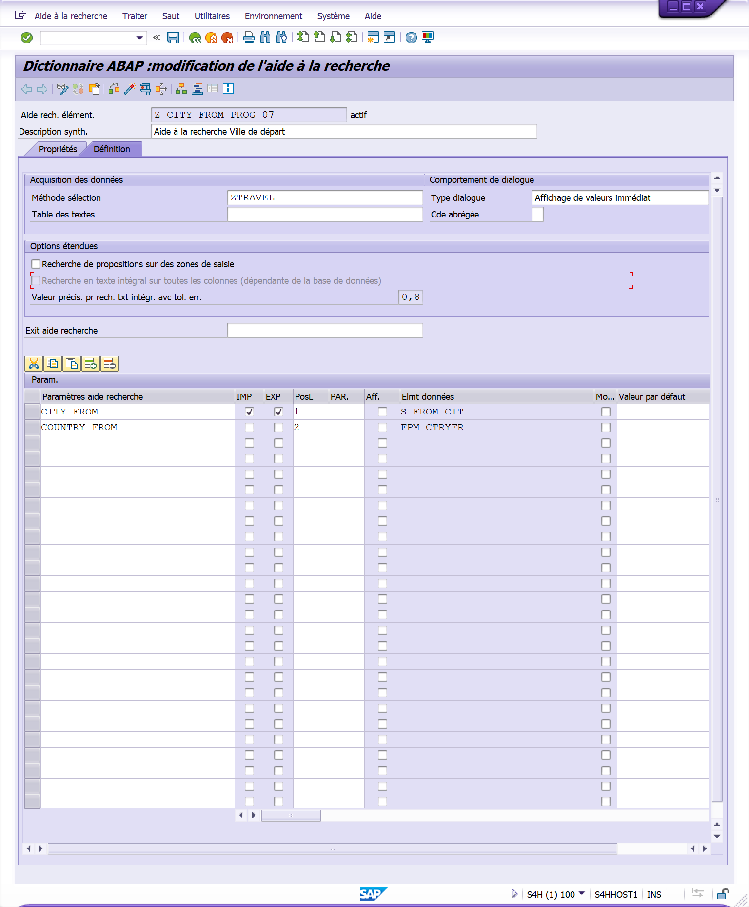

# **DATA MATCH CODE**

`INCLUDE TOP`

```abap
TABLES: ZTRAVEL.
```

`INCLUDE SCR`

```abap
SELECTION-SCREEN BEGIN OF BLOCK bl000 WITH FRAME TITLE TEXT-000.

    PARAMETERS: p_radio1 RADIOBUTTON GROUP rbg1 USER-COMMAND uc1 DEFAULT 'X'.

    SELECTION-SCREEN BEGIN OF BLOCK bl010 WITH FRAME TITLE TEXT-010.

        PARAMETERS :    p_id     TYPE zpassenger-id_passenger MODIF ID sc2,
                        p_surnam TYPE zpassenger-surname MODIF ID sc2 MATCHCODE OBJECT Z_NAME_PROG_07,
                        p_name   TYPE zpassenger-name MODIF ID sc2 MATCHCODE OBJECT Z_SURNAME_PROG_07,
                        p_dateb  TYPE zpassenger-date_birth MODIF ID sc2,
                        p_city   TYPE zpassenger-city MODIF ID sc2 MATCHCODE OBJECT Z_CITY_PROG_07,
                        p_count  TYPE zpassenger-country MODIF ID sc2,
                        p_lang   TYPE zpassenger-lang MODIF ID sc2 MATCHCODE OBJECT Z_LANG_PROG_07.

        PARAMETERS :    p_date   TYPE ztravel-date_travel MODIF ID sc2,
                        p_hour   TYPE ztravel-hour_travel MODIF ID sc2,
                        p_id_d   TYPE ztravel-id_driver MODIF ID sc2 MATCHCODE OBJECT Z_ID_DRIVER_PROG_07,

                        p_idp1   TYPE zpassenger_id MODIF ID sc2,
                        p_idp2   TYPE ztravel-id_passenger2 MODIF ID sc2,
                        p_idp3   TYPE ztravel-id_passenger3 MODIF ID sc2,

                        p_citf   TYPE ztravel-city_from MODIF ID sc2 MATCHCODE OBJECT Z_CITY_FROM_PROG_07,
                        p_counf  TYPE ztravel-country_from MODIF ID sc2 MATCHCODE OBJECT Z_COUNTRY_FROM_PROG_07,
                        p_citt   TYPE ztravel-city_to MODIF ID sc2 MATCHCODE OBJECT Z_CITY_TO_PROG_07,
                        p_counto TYPE ztravel-country_to MODIF ID sc2 MATCHCODE OBJECT Z_COUNTRY_TO_PROG_07,
                        p_kms    TYPE ztravel-kms MODIF ID sc2,
                        p_kms_u  TYPE ztravel-kms_unit MODIF ID sc2,
                        p_dur    TYPE ztravel-duration MODIF ID sc2,
                        p_toll   TYPE ztravel-toll MODIF ID sc2,
                        p_gazol  TYPE ztravel-gasol MODIF ID sc2,
                        p_unit   TYPE ztravel-unit MODIF ID sc2.

    SELECTION-SCREEN END OF BLOCK bl010.

    PARAMETERS: p_radio2 RADIOBUTTON GROUP rbg1.

    SELECTION-SCREEN BEGIN OF BLOCK bl020 WITH FRAME TITLE TEXT-020.

        SELECT-OPTIONS s_datet FOR ztravel-date_travel MODIF ID sc1.
        SELECT-OPTIONS s_cityf FOR ztravel-city_from  MODIF ID sc1 .
        SELECT-OPTIONS s_cityt FOR ztravel-city_to MODIF ID sc1 .

    SELECTION-SCREEN END OF BLOCK bl020.

SELECTION-SCREEN END OF BLOCK bl000.
```


