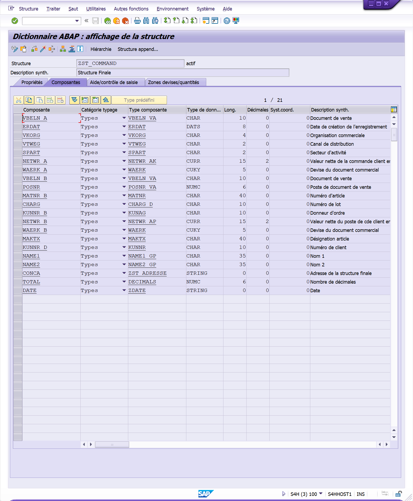

# **DATA MERGING**

`PROGRAM`

```abap
REPORT ZFGI_FORMATION_03 NO STANDARD PAGE HEADING.

INCLUDE zfgi_formation_03_top.
INCLUDE zfgi_formation_03_scr.
INCLUDE zfgi_formation_03_f01.

START-OF-SELECTION.

  PERFORM DATA_SELECT.

END-OF-SELECTION.
```

`INCLUDE TOP`

```abap
TABLES: vbak, vbap, kna1.

TYPES: BEGIN OF ty_vbak,
         vbeln     TYPE   vbak-vbeln,
         erdat     TYPE   vbak-erdat,
         vkorg     TYPE   vbak-vkorg,
         vtweg     TYPE   vbak-vtweg,
         spart     TYPE   vbak-spart,
         netwr     TYPE   vbak-netwr,
         waerk     TYPE   vbak-waerk,
       END OF ty_vbak,
       ty_t_vbak   TYPE TABLE OF ty_vbak,

       BEGIN OF ty_vbap,
         vbeln     TYPE   vbap-vbeln,
         posnr     TYPE   vbap-posnr,
         matnr     TYPE   vbap-matnr,
         pmatn     TYPE   vbap-pmatn,
         charg     TYPE   vbap-charg,
         zmeng     TYPE   vbap-zmeng,
         kunnr_ana TYPE   vbap-kunnr_ana,
         netwr     TYPE   vbap-netwr,
         waerk     TYPE   vbap-waerk,
       END OF ty_vbap,
       ty_t_vbap   TYPE TABLE OF ty_vbap,

       BEGIN OF ty_makt,
         matnr     TYPE   makt-matnr,
         maktx     TYPE   makt-maktx,
       END OF ty_makt,
       ty_t_makt TYPE TABLE OF ty_makt,

       BEGIN OF ty_kna1,
         kunnr     TYPE   kna1-kunnr,
         name1     TYPE   kna1-name1,
         name2     TYPE   kna1-name2,
         stras     TYPE   kna1-stras,
         pstlz     TYPE   kna1-pstlz,
         ort01     TYPE   kna1-ort01,
         land1     TYPE   kna1-land1,
       END OF ty_kna1,
       ty_t_kna1   TYPE TABLE OF ty_kna1.

DATA: gt_final     TYPE TABLE OF zst_command.
```



`INCLUDE SCR`

```abap
SELECTION-SCREEN BEGIN OF BLOCK b00 WITH FRAME TITLE TEXT-000.

  SELECTION-SCREEN BEGIN OF BLOCK b01 WITH FRAME TITLE TEXT-001.
    PARAMETERS:       p_france AS CHECKBOX USER-COMMAND flag,
                      p_world  AS CHECKBOX USER-COMMAND flag.
  SELECTION-SCREEN END OF BLOCK b01.

  SELECTION-SCREEN BEGIN OF BLOCK b02 WITH FRAME TITLE TEXT-002.
    SELECT-OPTIONS:   s_vbeln FOR vbak-vbeln MODIF ID bl2 MATCHCODE OBJECT zkdev_matnr, " SE11
                      s_matnr FOR vbap-matnr MODIF ID bl2,
                      s_charg FOR vbap-charg MODIF ID bl2,
                      s_kunnr FOR vbap-kunnr_ana MODIF ID bl2.
  SELECTION-SCREEN END OF BLOCK b02.

  SELECTION-SCREEN BEGIN OF BLOCK b03 WITH FRAME TITLE TEXT-003.
    SELECT-OPTIONS:   s_vbelnw FOR vbak-vbeln MODIF ID bl3 OBLIGATORY DEFAULT "01",
                      s_matnrw FOR vbap-matnr MODIF ID bl3,
                      s_chargw FOR vbap-charg MODIF ID bl3,
                      s_kunnrw FOR vbap-kunnr_ana MODIF ID bl3.
  SELECTION-SCREEN END OF BLOCK b03.

SELECTION-SCREEN END OF BLOCK b00.

AT SELECTION-SCREEN OUTPUT.

  LOOP AT SCREEN.

    IF
      p_france <> 'X' AND
      screen-group1 = 'BL2'.
      screen-active = '0'.
    ELSEIF
      p_world <> 'X' AND
      screen-group1 = 'BL3'.
      screen-active = '0'.
    ENDIF.

    MODIFY SCREEN.

  ENDLOOP.
```

`INCLUDE F01`

```abap
FORM data_select.

  DATA: lt_vbak TYPE TABLE OF ty_vbak,
        lt_vbap TYPE TABLE OF ty_vbap,
        lt_makt TYPE TABLE OF ty_makt,
        lt_kna1 TYPE TABLE OF ty_kna1.

  SELECT vbeln erdat vkorg vtweg spart netwr waerk
    FROM vbak
    INTO TABLE lt_vbak
    WHERE vbeln IN s_vbeln. "table range

  SELECT vbeln posnr matnr charg kunnr_ana netwr waerk
    FROM vbap
    INTO TABLE lt_vbap
    FOR ALL ENTRIES IN lt_vbak
    WHERE vbeln = lt_vbak-vbeln
    AND matnr IN s_matnr
    AND charg IN s_charg
    AND kunnr_ana IN s_kunnr.

  SELECT matnr maktx
    FROM makt
    INTO TABLE lt_makt
    FOR ALL ENTRIES IN lt_vbap
    WHERE matnr = lt_vbap-matnr.

  SELECT kunnr name1 name2 stras pstlz ort01 land1
    FROM kna1
    INTO TABLE lt_kna1
    FOR ALL ENTRIES IN lt_vbap
    WHERE kunnr = lt_vbap-kunnr_ana.

  PERFORM: DATA_MERGING USING lt_vbak lt_vbap lt_makt lt_kna1.

ENDFORM.
```

```abap
FORM data_merging USING ut_vbak TYPE ty_t_vbak
                        ut_vbap TYPE ty_t_vbap
                        ut_makt TYPE ty_t_makt
                        ut_kna1 TYPE ty_t_kna1.

  DATA: ls_final LIKE LINE OF gt_final.

  LOOP AT ut_vbak ASSIGNING FIELD-SYMBOL(<fs_vbak>).
    CLEAR ls_final.

      ls_final-vbeln_a   = <fs_vbak>-vbeln.
      ls_final-erdat     = <fs_vbak>-erdat.
      ls_final-vkorg     = <fs_vbak>-vkorg.
      ls_final-vtweg     = <fs_vbak>-vtweg.
      ls_final-spart     = <fs_vbak>-spart.
      ls_final-netwr_a   = <fs_vbak>-netwr.
      ls_final-waerk_a   = <fs_vbak>-waerk.

      LOOP AT ut_vbap ASSIGNING FIELD-SYMBOL(<fs_vbap>) WHERE vbeln = <fs_vbak>-vbeln.

          ls_final-vbeln_b  = <fs_vbap>-vbeln.
          ls_final-posnr    = <fs_vbap>-posnr.
          ls_final-matnr_b  = <fs_vbap>-matnr.
          ls_final-charg    = <fs_vbap>-charg.
          ls_final-kunnr_b 	= <fs_vbap>-kunnr_ana.
          ls_final-netwr_b 	= <fs_vbap>-netwr.
          ls_final-waerk_b 	= <fs_vbap>-waerk.

          ls_final-total    = <fs_vbap>-pmatn * <fs_vbap>-zmeng.

          READ TABLE ut_makt ASSIGNING FIELD-SYMBOL(<fs_makt>) WITH KEY matnr = <fs_vbap>-matnr.

          IF sy-subrc = 0.
            ls_final-maktx 	  = <fs_makt>-maktx.
          ENDIF.

          READ TABLE ut_kna1 ASSIGNING FIELD-SYMBOL(<fs_kna1>) WITH KEY kunnr = <fs_vbap>-kunnr_ana.

          IF sy-subrc = 0.
            ls_final-kunnr_d  = <fs_kna1>-kunnr.
            ls_final-name1 	  = <fs_kna1>-name1.
            ls_final-name2 	  = <fs_kna1>-name2.

            CONCATENATE <fs_kna1>-stras' ' <fs_kna1>-pstlz' ' <fs_kna1>-ort01' ' <fs_kna1>-land1 INTO ls_final-conca.
          ENDIF.

          APPEND ls_final TO gt_final.

      ENDLOOP.

  ENDLOOP.

ENDFORM.
```
