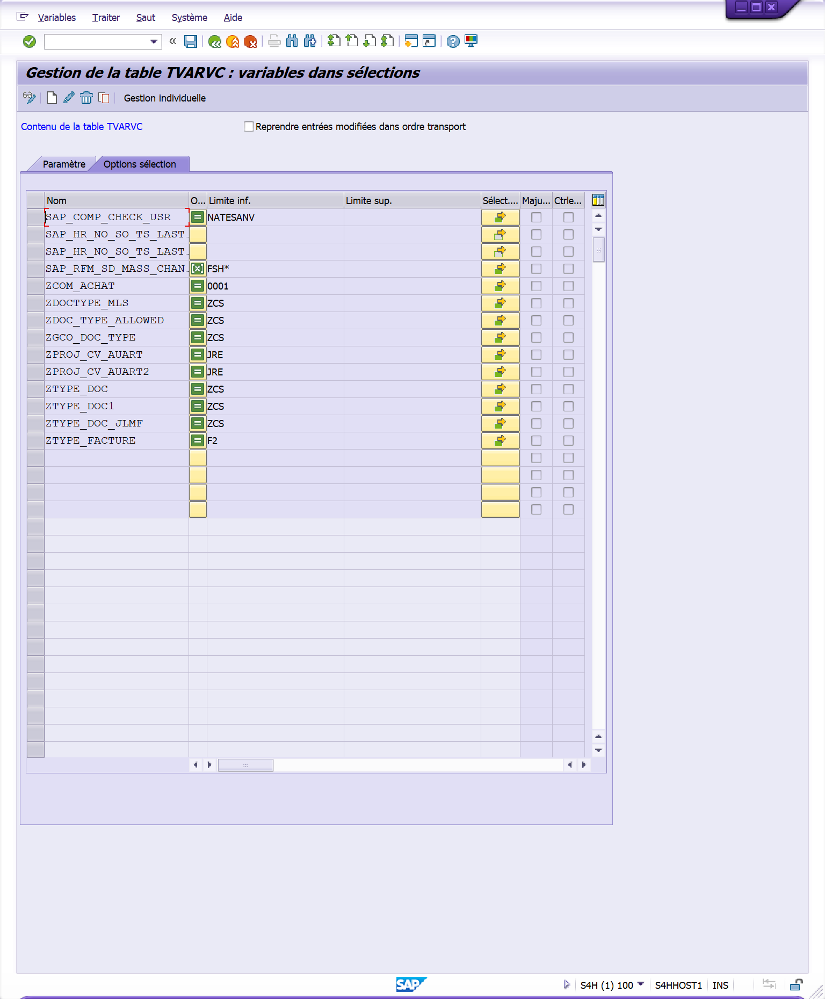

# **FEATURE DATA TVARVC FILTERING**

`PROGRAM`

```abap
REPORT zfgi_prog NO STANDARD PAGE HEADING.

INCLUDE zfgi_prog_top.
INCLUDE zfgi_prog_scr.
INCLUDE zfgi_prog_f01.

INITIALIZATION.

START-OF-SELECTION.

    PERFORM DATA_TVARVC_FILTERING.

END-OF-SELECTION.
```

`INCLUDE TOP`

```abap
TYPES:  BEGIN OF ty_data,
    id_com        TYPE zid_com_po,
    doc_type      TYPE vbak-auart,
    sales_org     TYPE vbak-vkorg,
    distr_chan    TYPE vbak-vtweg,
    sect_act      TYPE vbak-spart,
    partn_role_ag TYPE parvw,
    partn_numb_ag TYPE vbak-kunnr,
    partn_role_we TYPE parvw,
    partn_numb_we TYPE vbak-kunnr,
    itm_numb      TYPE vbap-posnr,
    material      TYPE vbap-matnr,
    plant         TYPE vbap-werks,
    quantity      TYPE vbap-zmeng,
    quantity_unit TYPE vbap-zieme,
END OF ty_data.

DATA: gt_data             TYPE STANDARD TABLE OF ty_data,
      gt_data_error       TYPE STANDARD TABLE OF ty_data.
```

`TRANSACTION STVARV`



`INCLUDE F01`

```abap
FORM data_tvarvc_filtering.
    DATA: lr_auart      TYPE RANGE OF auart,
          ls_auart      LIKE LINE OF lr_auart,
          lt_tvarvc     TYPE STANDARD TABLE OF tvarvc.

    SELECT *
        FROM tvarvc
        INTO TABLE lt_tvarvc
        WHERE name = 'ZPROJ_CV_AUART'
        AND type = 'S'.

    IF sy-subrc = 0.
        LOOP AT lt_tvarvc ASSIGNING FIELD-SYMBOL(<fs_tvarvc>).
            ls_auart-sign   = <fs_tvarvc>-sign.
            ls_auart-option = <fs_tvarvc>-opti.
            ls_auart-low    = <fs_tvarvc>-low.

            APPEND ls_auart TO lr_auart.
        ENDLOOP.
    ENDIF.

    LOOP AT gt_data INTO DATA(ls_data).
        IF NOT ls_data-doc_type IN lr_auart.
            APPEND ls_data TO gt_data_error.
        ENDIF.
    ENDLOOP.

    LOOP AT gt_data_error ASSIGNING FIELD-SYMBOL(<fs_error>).
        DELETE gt_data WHERE id_com = <fs_error>-id_com.
    ENDLOOP.
ENDFORM.
```
