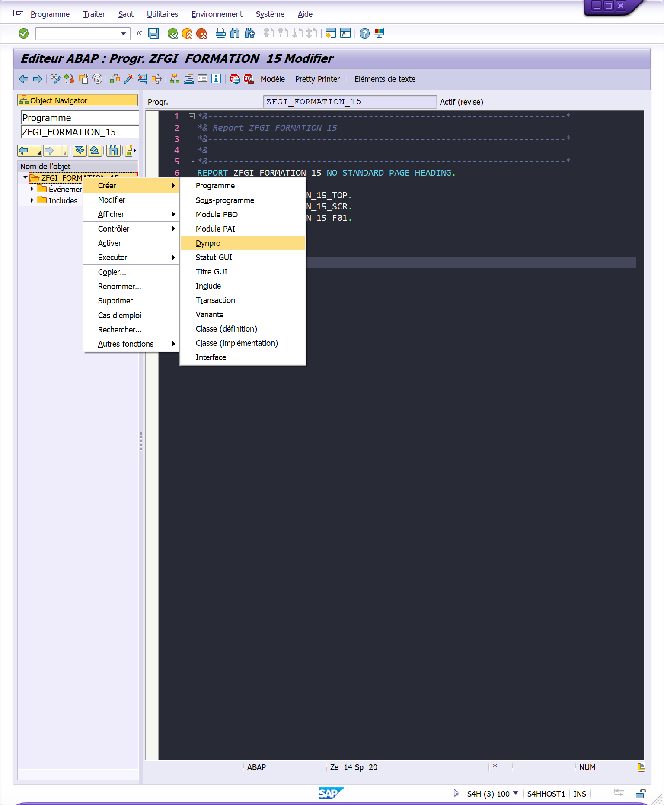
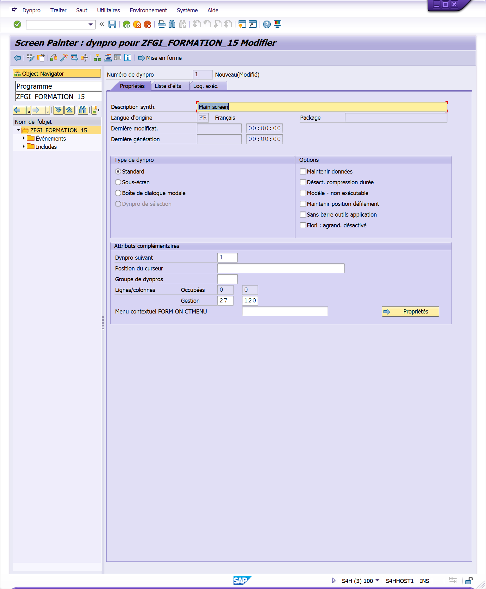
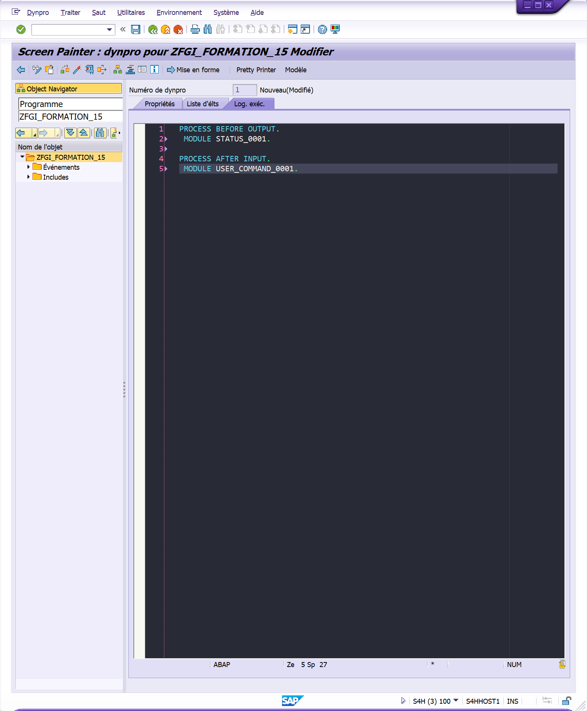
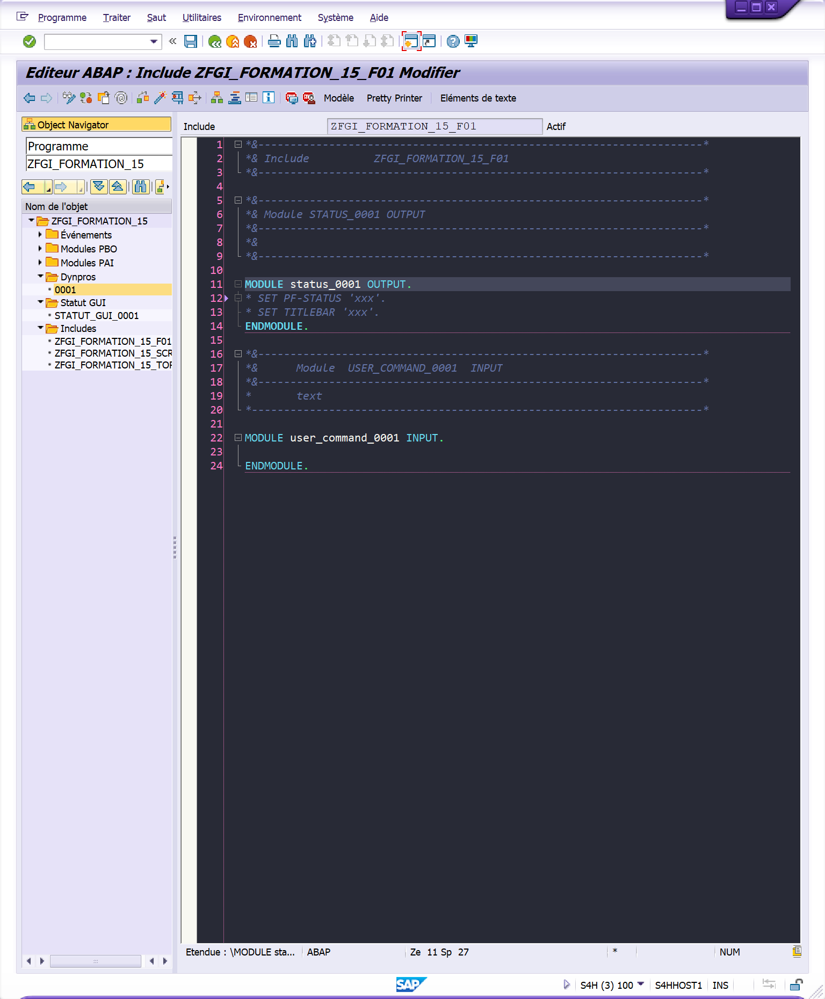
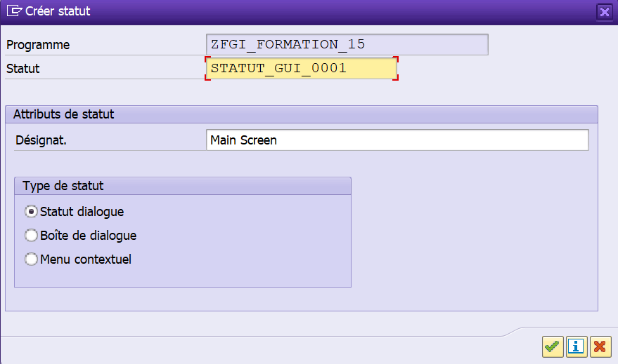
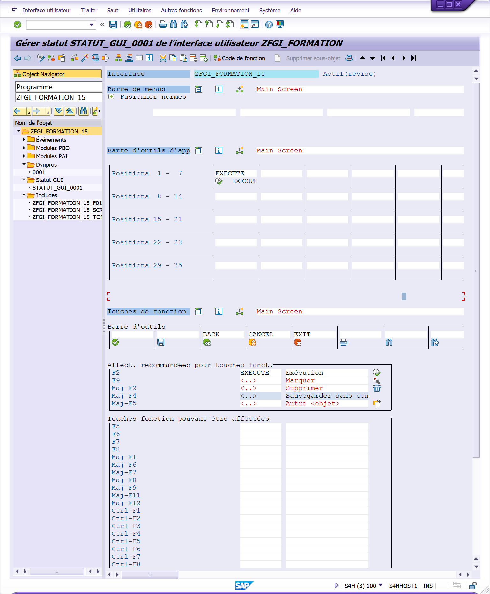

# **DYNPROP**

`DYNPRO 0001 CREATION`



`DYNPRO 0001 SETTINGS & MODULE CREATION`







`STATUT GUI CREATION`




`STATUT GUI SETTINGS`



`DYNPRO 0001 BINDING & ASSIGNING SHORTCUTS`


`PROGRAM`

```abap
REPORT zfgi_prog NO STANDARD PAGE HEADING.

INCLUDE zfgi_prog_top.
INCLUDE zfgi_prog_scr.
INCLUDE zfgi_prog_f01.

INITIALIZATION.

START-OF-SELECTION.

  CALL SCREEN 0001.

END-OF-SELECTION.
```
