# **FUNCTION MODULE**

`TRANSACTION SE37`

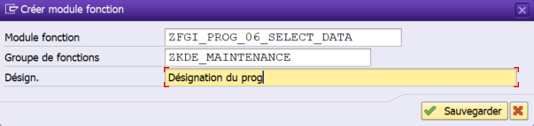

`TRANSACTION SE37 : PROPRIETES`

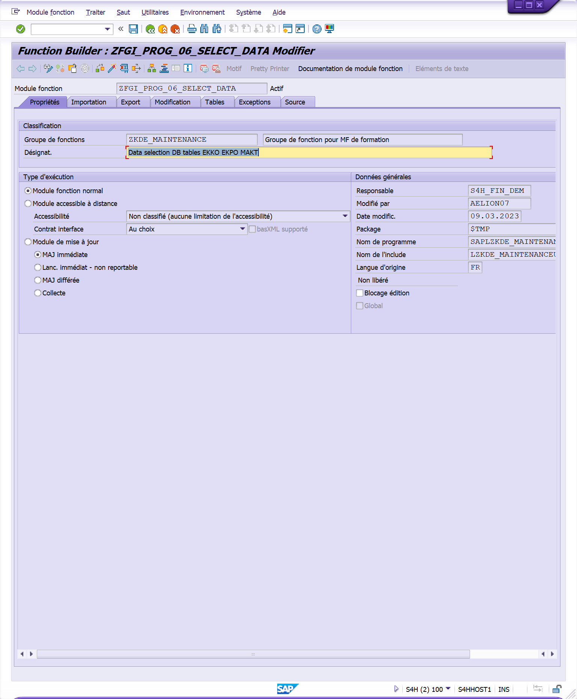

`TRANSACTION SE37 : IMPORTATION`

- **Nom paramètre** : `I_` (pour Importation) ou `IV_`, `IS_`, `IT_` ...

- **Catégorisation** : `LIKE`, `TYPE` ou `TYPE REF TO`

  (`LIKE` et `TYPE`) font référence à un _élément de données_ de type élémentaire

  (`TYPE REF TO`) fait référence à une _Classe_ ou _Interface_ lors de l'utilisation de l'ABAP Objet, à un _champ_ d'une _table_ / _structure_ ou à une _structure entière_

- **Type référence** : élément de donnée (si `LIKE` ou `TYPE`), champ d'une table / structure (si `TYPE REF TO`)

- **Valeur par défaut** : précise si le champ doit être renseigné par une valeur prédéfinie

- **Facultative** : Fixe le paramètre comme `optionnel`, il n'est donc pas nécessaire de lui attribuer une variable lors de l'appel de la fonction

- **Passage par valeur** : A ne plus utiliser pour raison de mauvaises performances

- **Désignation** : se renseigne automatiquement via l'`élément de donnée` ou le champ de la `table` / `structure`

- **Texte descriptif** : Editer une aide pour le paramètre de la fonction

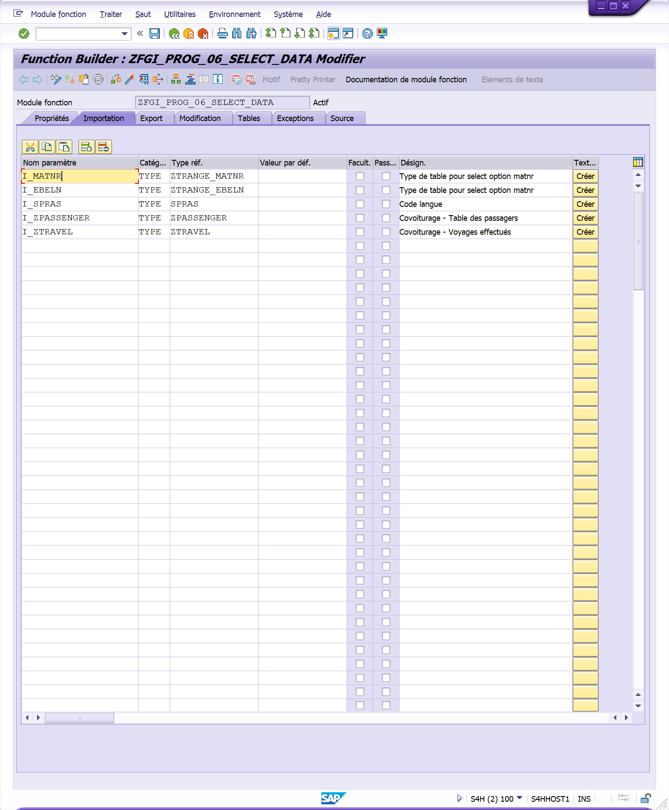

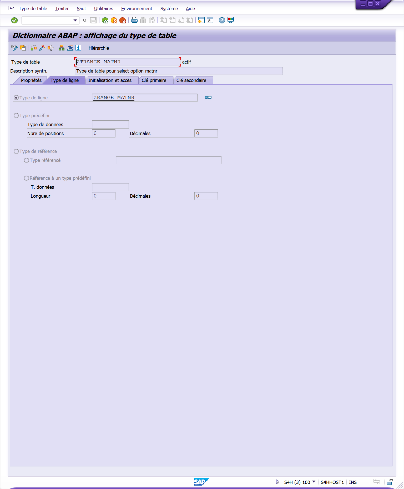

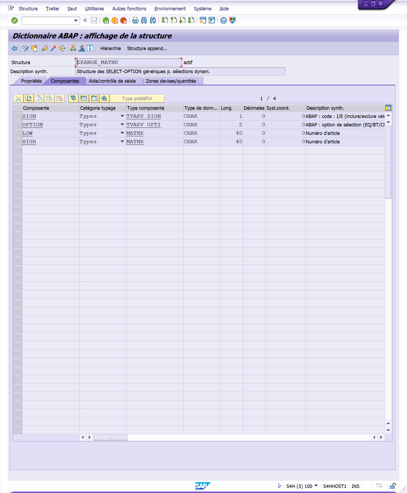

`TRANSACTION SE37 : EXPORTATION`

- **Nom paramètre** : `E_` (pour Exportation) ou `EV_`, `ES_`, `ET_` ...

- **Catégorisation** : `LIKE`, `TYPE` ou `TYPE REF TO`

  (`LIKE` et `TYPE`) font référence à un _élément de données_ de type élémentaire

  (`TYPE REF TO`) fait référence à une _Classe_ ou _Interface_ lors de l'utilisation de l'ABAP Objet, à un _champ_ d'une _table_ / _structure_ ou à une _structure entière_

- **Type référence** : élément de donnée (si `LIKE` ou `TYPE`), champ d'une table / structure (si `TYPE REF TO`)

- **Passage par valeur** : A ne plus utiliser pour raison de mauvaises performances

- **Désignation** : se renseigne automatiquement via l'`élément de donnée` ou le champ de la `table` / `structure`

- **Texte descriptif** : Editer une aide pour le paramètre de la fonction

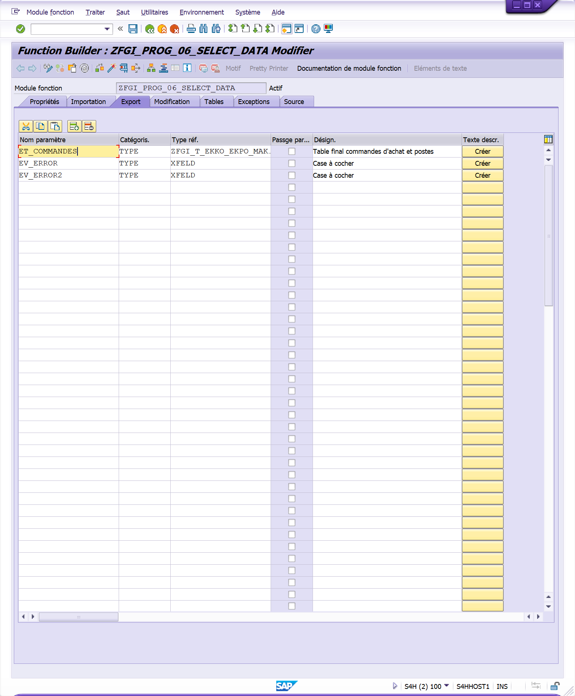

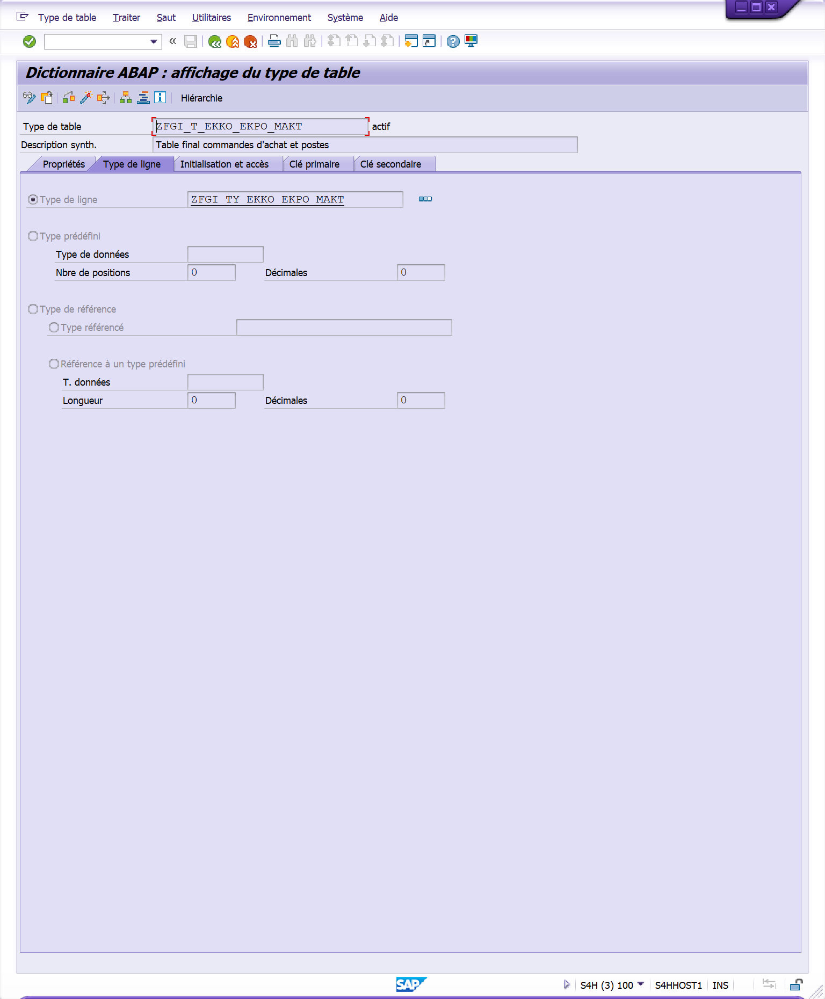

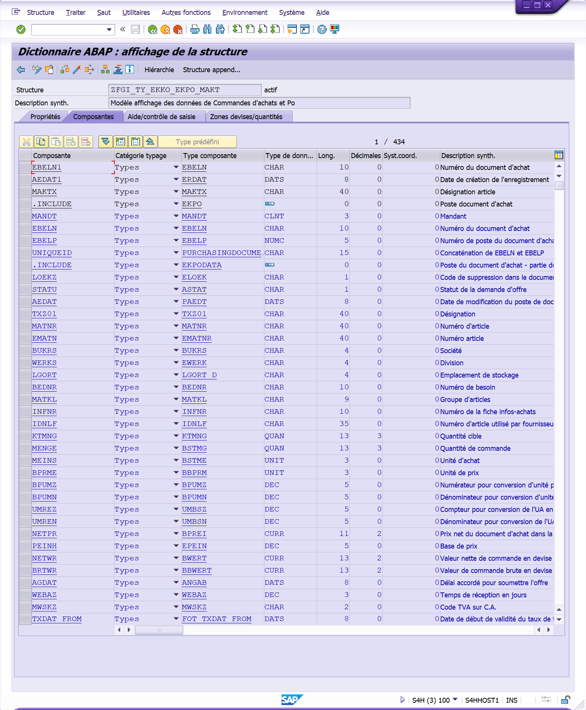

`TRANSACTION SE37 : MODIFICATION`

Les paramètres de modification quant à eux, sont à la fois des paramètres d’importation et de sortie. Ainsi, leur valeur peut changer pendant l’exécution de la fonction (il n’est pas possible de modifier la valeur des paramètres d’entrée). Concernant les informations du paramètre, ce sont exactement les mêmes que pour l’importation :

- **Nom paramètre** : `C_` (pour Changement) ou `CV_`, `CS_`, `CT_` ...

- **Catégorisation** : `LIKE`, `TYPE` ou `TYPE REF TO`

  (`LIKE` et `TYPE`) font référence à un _élément de données_ de type élémentaire

  (`TYPE REF TO`) fait référence à une _Classe_ ou _Interface_ lors de l'utilisation de l'ABAP Objet, à un _champ_ d'une _table_ / _structure_ ou à une _structure entière_

- **Type référence** : élément de donnée (si `LIKE` ou `TYPE`), champ d'une table / structure (si `TYPE REF TO`)

- **Valeur par défaut** : précise si le champ doit être renseigné par une valeur prédéfinie

- **Facultative** : Fixe le paramètre comme `optionnel`, il n'est donc pas nécessaire de lui attribuer une variable lors de l'appel de la fonction

- **Passage par valeur** : A ne plus utiliser pour raison de mauvaises performances

- **Désignation** : se renseigne automatiquement via l'`élément de donnée` ou le champ de la `table` / `structure`

- **Texte descriptif** : Editer une aide pour le paramètre de la fonction

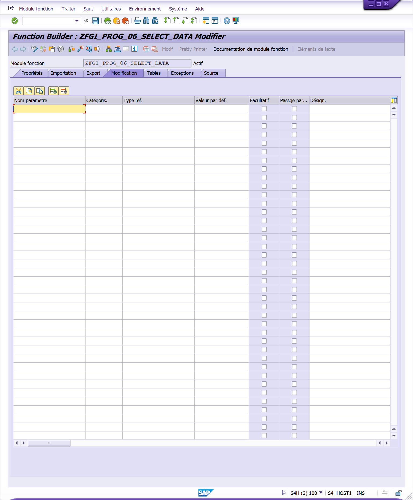

`TRANSACTION SE37 : TABLES`

L’onglet Tables, comme son nom l’indique, va contenir la liste des tables à utiliser dans la fonction, cependant une table peut être modifiable, elle peut donc être à la fois un paramètre d’entrée comme de sortie. Elle possède également les mêmes informations que l’onglet Export :

- **Nom paramètre** : `T_` (pour Table)

- **Catégorisation** : T_TRAVEL `LIKE` ZTT_TRAVEL

- **Type référence** : élément de donnée (si `LIKE` ou `TYPE`), champ d'une table / structure (si `TYPE REF TO`)

- **Facultative** : Fixe le paramètre comme `optionnel`, il n'est donc pas nécessaire de lui attribuer une variable lors de l'appel de la fonction

- **Désignation** : se renseigne automatiquement via l'`élément de donnée` ou le champ de la `table` / `structure`

- **Texte descriptif** : Editer une aide pour le paramètre de la fonction

Pour que le paramètre `T_TRAVEL` soit considéré comme une `table`, il est nécessaire d’utiliser un `Type de table`. Un `Type de table` est une sorte de structure qui va définir la ligne servant de modèle. Par exemple, si on souhaite utiliser la table `ZTRAVEL` dans la fonction, il faudra créer le `Type de table` correspondant en `SE11` en prenant comme `Type de ligne` la table `ZTRAVEL`.

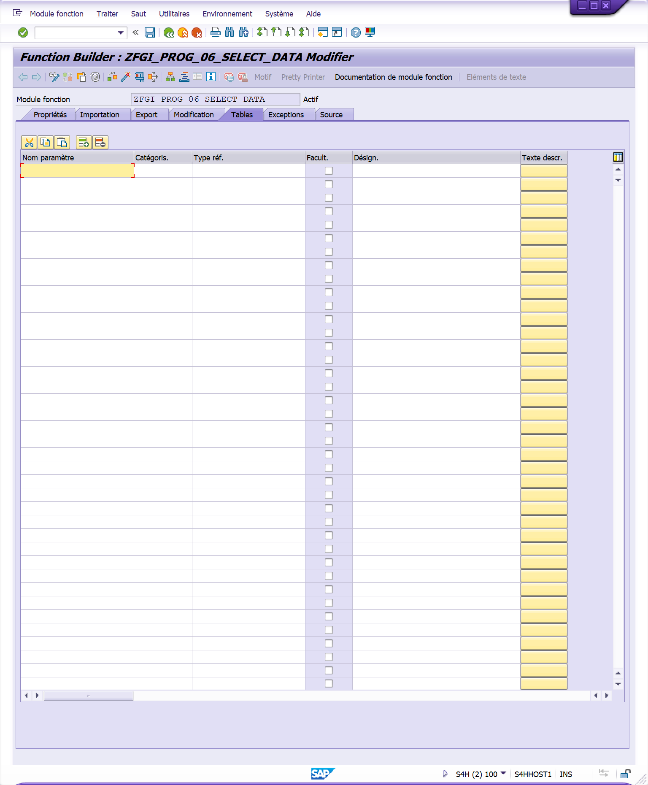

`TRANSACTION SE37 : EXCEPTIONS`

Les exceptions sont une liste d’erreurs que la fonction peut retourner, il serait possible d’utiliser à la place des messages, mais les exceptions donnent la possibilité aux développeurs de les gérer comme ils le souhaitent et sont aussi plus pratiques lorsqu’il s’agit de fonctions de type RFC.

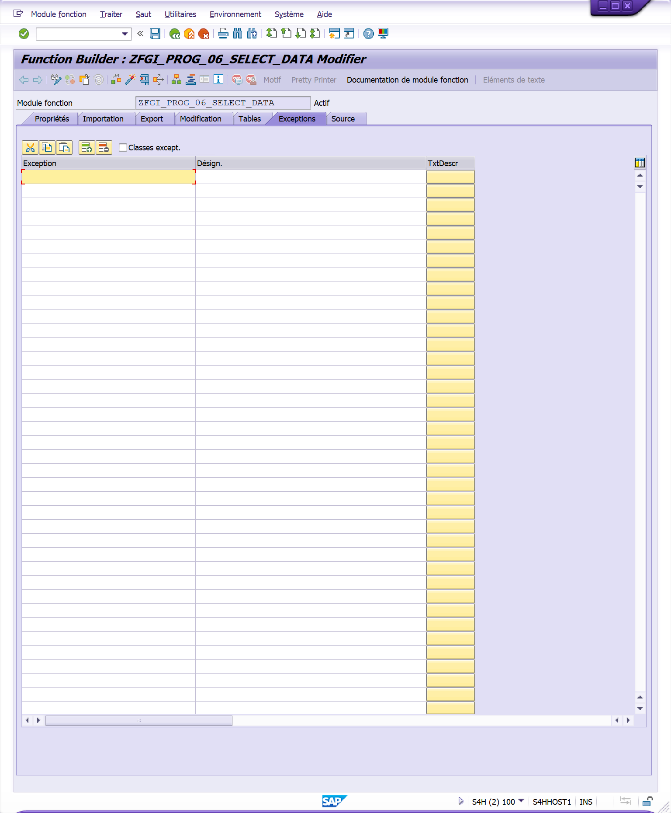

`TRANSACTION SE37 : SOURCE`

Le dernier onglet Source contient le code ABAP utilisé par la fonction. Lorsque les paramètres ont été déterminé, la fonction va toujours lister tous les paramètres dès le début du code.

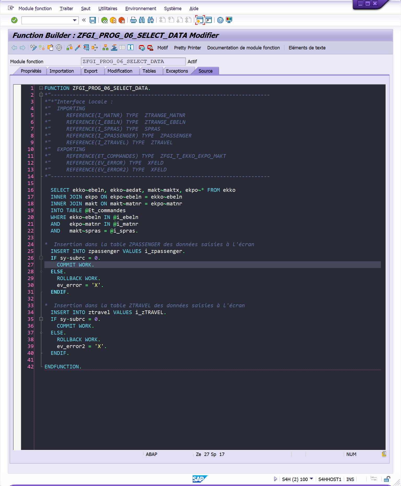
